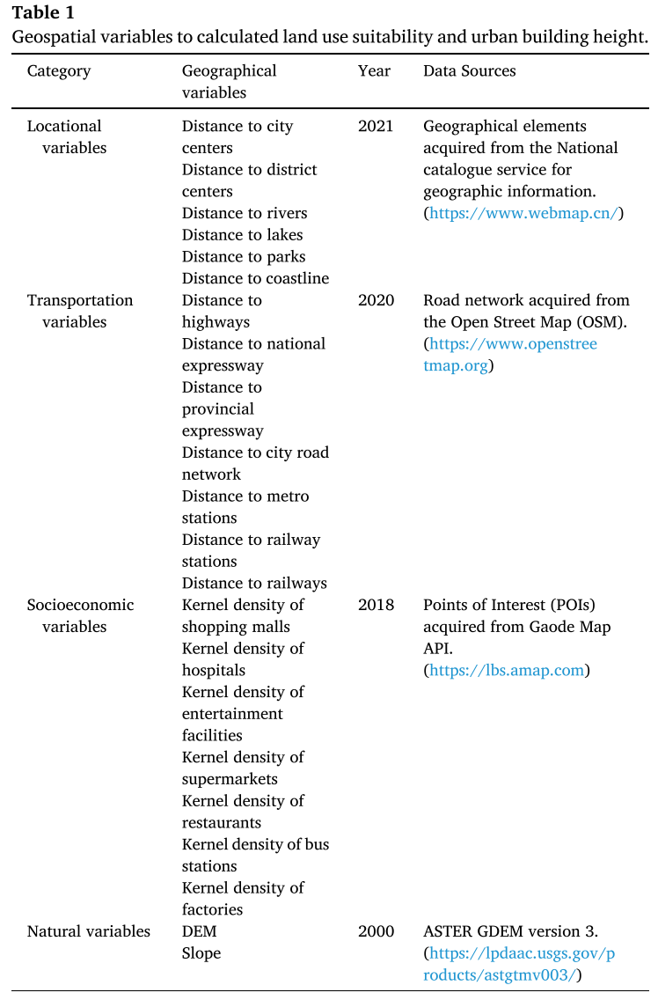

+++
draft = false
date = 2025-07-28T10:14:14+08:00
title = "【文献阅读】A Three Dimensional Future Land Use Simulation (FLUS 3D) Model for Simulating the 3D Urban Dynamics Under the Shared Socio Economic Pathways"
authors = ["RONGHUA LI"]
tags = ["FLUS","城市三维扩张"]
categories = ["文献阅读"]
series = ["城市扩张模拟"]

+++

# 文献信息

<table class="custom-table" style="border-collapse: collapse; font-size: 20px; margin-bottom: 30px;">
  <tr>
    <td>第一作者：许晓聪</td>
    <td class="unit-cell">
        
作者单位：中山大学地理与规划学院

  		
&emsp;&emsp;&emsp;&emsp;&emsp;广东省城市化与地理模拟重点实验室

    </td>
  </tr>
  <tr>
    <td>通讯作者：刘小平</td>
    <td class="unit-cell">
        
作者单位：中山大学地理与规划学院

  		
&emsp;&emsp;&emsp;&emsp;&emsp;广东省城市化与地理模拟重点实验室

    </td>
  </tr>
  <tr>
    <td>期刊：Landscape and Urban Planning</td>
    <td>发表时间：2024年6月17日</td>
  </tr>
    <tr>
    <td>中科院分区：1区</td>
    <td>影响因子：9.2</td>
  </tr>
</table>

https://doi.org/10.1016/j.landurbplan.2024.105135

# 研究背景

## 研究现状

### 模拟二维城市土地利用变化

**早期的城市增长模型**

自上世纪末以来，研究人员已开发出多种模拟二维城市土地利用变化的模型，这些模型在假设、方法论和所解决的城市相关问题上各不相同（He 等，2008；Li 和 Gong，2016）。

这些城市增长模型主要分为以下几类：

- 土地利用交通模型（Hunt 等，2005）
- 基于主体的模型（An，2012；Matthews 等，2007）
- 城市经济模型（Irwin，2010）
- 元胞自动机（CA）模型（Santé 等，2010）。

其中，**CA模型因其广泛的适用性成为模拟城市土地利用扩展中最常用的模型**（Clarke，2019；Li 等，2017；Li 和 Gong，2016；White 等，2012；Wu，2002）。

CA模型是一种**自底向上**的离散模型，能够通过简单的转化规则和局部单元之间的相互作用，模拟复杂的全球系统的时空演化（Li 等，2011；Santé 等，2010）。

**改进的城市增长模型**

在此基础上，研究人员还开发了一系列二维城市扩展模拟模型，包括 SLEUTH（Clarke 等，1997）、Logistic-CA（Wu，2002）、CLUE-S（Verburg 等，2002）、基于活动的CA（van Vliet 等，2012）、LUSD-urban（He 等，2017a）、PatchCA（Chen 等，2019b）、**FLUS模型**（Liu 等，2017）等。

**引入机器学习的城市增长模型**

此外，将机器学习和深度学习方法引入CA模型的开发中，极大地提高了模型的精度和可靠性，主要得益于其**在转化规则中对非线性的更优表现**（Charif 等，2017；He 等，2018；Omrani 等，2015；Shafizadeh-Moghadam 等，2021；Wu 等，2022；Xu 等，2022）。

如前所述，目前大多数模型主要集中于从二维水平视角模拟城市扩展（Gemitzi，2021；Liu 等，2021）。尽管这些模型在反映快速增长的城市人口对土地利用的需求方面具有重要意义，但**其对建筑垂直空间和三维空间容量的考量却常常被忽视**。因此，当这些模型被用于模拟现实城市的三维扩展时，不仅无法准确反映城市在垂直方向的增长信息，还在水平方向上的模拟布局中表现出明显的偏差。

### 历史时期的三维城市建模

近年来，一些研究已经建立了模型和数据，用于开展历史时期的三维和高密度城市分析。

Yang 和 Lee（2019）在韩国群山采用航拍图像、地面激光雷达（LiDAR）和全站仪技术，开发并测试了一种自动化三维城市建模应用。

为了将建筑信息建模（BIM）中的建筑构件和空间有效整合，Zhou 等（2021）提出了一种结合扩展工业基础类（IFC）与不动产信息的三维不动产数据模型，用于整合 BIM 中的建筑构件与空间信息。

Wang 等（2023）利用 Landsat 时间序列数据，重建了北京市1990至2020年间建成区的年度三维高度变化，以分析过去三十年城市增长的模式。

### 三维扩张模拟的探索

近年来，部分研究开始将建筑高度信息引入元胞自动机（CA）模型，开展三维模拟的初步探索。

一项研究提出了一种准三维CA模拟模型，通过在单元属性中加入建筑高度信息，并结合一组多样化参数，用以模拟不同类型的城市形态（Benguigui 等，2008）。

另一项研究则在CA模型中引入预设的“IF-THEN”规则集，模拟了中国广州城市建成区高度增长的不同状态（Lin 等，2014）。

随后，一些研究者提出结合机器学习方法，如反向传播人工神经网络（BPANN）和随机森林算法（RFA），**在传统CA模型模拟完成后，用于预测城市扩展的垂直高度**（He 等，2017b；Zhao 等，2022）。

同期也有基于地块的CA研究，利用RFA在模拟出所有已开发地块后，进一步预测其建筑高度或体量（Chen，2022；He 等，2023）。

此外，还有研究结合地理信息系统（GIS）和加权线性组合方法，推算土耳其地区的容积率，并预测其至2030年和2040年的城市扩展情况（Kuru 和 Yüzer，2021）。

还有一些研究尝试通过引入局地气候区（LCZ）概念到CA模型中，对建筑高度的离散类别（如低层、中层、高层）变化进行模拟（Chen 等，2021；Huang 等，2021）。

类似地，Koziatek 和 Dragićević（2017）开发了 iCity 三维模型，用于预测加拿大萨里市中高层建筑的离散式垂直城市发展。

## 存在的问题

尽管在三维城市模拟方面已有初步进展，但大多数研究仍普遍采用了**将水平方向的城市扩展模拟与垂直高度估算分开进行再简单结合的方式**。换言之，这些研究大多通常先使用**传统的元胞自动机（CA）模型来模拟满足未来城市用地需求的水平扩张**，然后再对模拟得到的城市用地进行**独立的建筑高度估算**（下称“独立策略”）。

这种独立策略存在多个局限性：

（1）未来城市建筑空间的**需求应从三维视角（即三维建筑容量）加以量化**，而不仅仅是水平用地扩展。忽略垂直维度的扩展会不可避免地对未来城市范围的模拟结果产生偏差；

（2）在现实城市发展过程中，城市土地的**水平扩展与垂直增长在时间上是紧密相互关联的**。当前模型中简化的**“独立策略”人为地割裂了这两者之间的内在联系**，导致模型无法全面地表达三维城市扩展的时空动态过程；

（3）尽管将局地气候区（LCZ）引入模型在一定程度上可缓解这一问题，但其**对建筑高度的预设分类（如低层、中层、高层）过于粗略**，难以真实反映实际城市中连续变化的高度变量。此外，这些分类的定义及其划分方式也可能引入额外的不确定性与偏差。

## 研究目的

在现实中，城市的水平扩张与垂直增长往往是相互影响、动态交织的过程，二者并非独立发生。对此，本文提出的 FLUS-3D 模型在模拟过程中实现了水平方向的城市扩展与垂直建筑高度的同步迭代更新。

针对上述问题，开发原有 Future Land Use Simulation（FLUS）模型（Liu 等，2017）的三维版本，称为 FLUS-3D 模型，用以模拟现实城市发展的连续三维动态。

将所提出的模型应用于中国三个快速城市化的都市区，并在经过实证数据校准后，基于 SSP 框架进行水平与垂直城市增长的情景模拟。

## 研究意义

本文方法更真实地刻画了城市三维发展的时空动态特征，有望更准确地反映实际城市扩张过程。

考虑到三维城市结构是城市气候模拟的基本参数，所提出的模型可以潜在地用于与城市相关的研究气候变化减缓，以实现未来的城市可持续性。

# 研究区域和数据

## 研究区域

本研究选取的区域包括中国东部沿海的三个都市圈（见图1），它们在近几十年经历了快速城市化过程，分别为：**京津冀（BTH）、长三角（YRD）和珠三角（PRD）**地区。这些区域的三维城市建筑体量总体增长率超过 89%（范围为 66% 至 132%，见附表 S1），因此非常适合作为 FLUS-3D 模型有效性测试的研究对象。

此外，已有多项研究表明，这三个区域的城市形态在过去20年中普遍呈现出向高层建筑发展的趋势（Che 等，2024；He 等，2019；Yang 和 Zhao，2022；Zhao 等，2023）。因此，这三个研究区域可被视为快速城市化都市区的典型代表，特别是那些正处于从城市蔓延向垂直集约型发展过渡的城市地区。

京津冀（BTH）地区包括北京市、天津市及河北省的11个地级市，是中国北方最大的城市化都市圈。该区域传统上以重工业和制造业为主，其中北京在教育和科研开发领域发挥着重要作用。卫星观测数据显示（Liu 等，2020），BTH地区的城市范围从2000年的约7,500平方公里扩展至2015年的近13,000平方公里。

长三角（YRD）地区位于中国东部，是一个高度发达的经济区域，地处长江入海口的冲积平原。该地区人口密度最高、创新能力最强，占中国国土面积不足4%，却贡献了全国近四分之一的GDP。YRD地区的城市范围在2000年至2015年间迅速扩展了135%，从5,035平方公里增至11,900平方公里。

珠三角（PRD）地区位于广东省，包括九个城市，是中国南部发展最快的城市群之一。该地区的人口增长和城市化速度远超全国平均水平，建成区面积从2000年的2,846平方公里增长至2015年的近5,000平方公里，扩展主要集中在广州、佛山和东莞。

在中国政府的大力支持和相关优惠政策推动下，这三个都市圈的人口规模、城市范围及三维城市建筑体量预计将在未来继续快速增长。

## 研究数据

### 年度城市扩张动态

用途：构建历史城市扩张数据

来源：全球年度城市动态（Global Annual Urban Dynamics，GAUD）数据集（Liu 等，2020）

时间范围：1985年到2015年

空间分辨率：30米

选用原因：其在城市空间范围和年度变化方面具有较高的可靠性。

### 城市土地利用类型

用途：用于随机森林模型判断城市功能类型

来源：中国基础城市土地利用类型数据集（EULUC-China）（Gong 等，2020）

空间分辨率：30米

类别：五类主要的城市功能类型（见附表 S2）：**住宅用地、商业用地**（办公与商业服务）、**工业用地**、交通运输用地（道路、交通及机场设施），以及**公共服务用地**（包括行政、教育、医疗、体育文化、公园与绿地等）。

预处理：原始矢量数据被转换为30米空间分辨率的**栅格**，并确定了每个像元的城市功能类型。随后，通过高分辨率卫星影像的**目视解译**，对数据中的分类误差进行**校正**，并对存在明显错误的功能地块类型进行了调整（部分示例见图 S1）。

数据集：为每种城市功能类型随机生成了 20,000 个数据样本，并按照 75%（15,000 个样本）和 25%（5,000 个样本）的比例随机划分为校准组和测试组。

### 城市建筑高度数据

来源：高德地图 API（[https://www.amap.com）、百度地图 API（[https://ditu.baidu.com）

空间分辨率：30米

预处理：经过**数据清洗**后，基于建筑轮廓的矢量边界及其对应的高度信息，计算了每个30 × 30 米网格的**建筑体量**。随后，通过将建筑体量除以网格面积（即 30 × 30 平方米），估算出每个网格的**平均建筑高度**。

注意：由于这种平均处理方式，研究中所呈现的**建成高度数值可能低于现实中某些具体建筑的实际高度**。

对于每种城市功能类型，采集了 5,000 个样本用于 XGBoost 模型的训练，并使用另外 2,000 个独立样本对模型性能进行评估。为了解决高层建筑样本不足的问题，采用了一种数据增强策略：对高层建筑样本进行小尺度的随机扰动，从而增加样本数量。

### 地理空间变量

用途：建模土地利用适宜性、城市功能类型以及城市建筑高度。

变量：位置类变量、交通类变量、社会经济类变量以及自然环境类变量。

预处理：为避免不同单位所带来的尺度不一致问题，所有变量均被**归一化至 [0,1]** 区间。此外，为保持数据一致性，所有变量也被统一至 **30 米的空间分辨率**（详见图 S2）。

# 方法

本文提出的 FLUS-3D 模型是在 Liu 等（2017）开发的原始 FLUS 模型基础上的扩展。原始 FLUS 模型以及其他多数土地利用模拟模型的基本建模单元是网格单元（grid cell），其模拟的是土地利用状态在水平方向上的变化过程。而在 FLUS-3D 模型中，建模单元被拓展为一个“**地理立方体**”，不仅描述土地利用类型的状态，还同时包含其对应的**垂直高度信息**。

在模拟的每一次迭代中，FLUS-3D 模型根据转化概率、城市功能类型以及周边环境，**同时更新**土地利用类型与垂直高度，实现三维动态模拟。

模型的整体流程如图 2 所示，为 FLUS-3D 模型的流程图。

## 土地利用体积需求预测

在三维城市动态模拟中，**城市建筑体积**被用作“需求”的衡量指标，代表可为人口居住和社会经济活动提供的三维空间。

### 特定城市功能用地类型的未来建筑体量需求

在本研究中，特定城市功能用地类型的未来建筑体量需求通过**未来人口规模**与**人均建筑体量**共同决定。

本研究共考虑了四类城市功能用地类型：**商业用地、住宅用地、工业用地和公共服务用地**。在每一种共享社会经济路径（SSP）情景下，各类用地的未来体量需求通过以下公式进行计算：
$$
\text{VolDemand}^{\text{SSP}}_k = \text{Pop}^{\text{SSP}} \times \text{Area}^k_{\text{pc}} \times \text{FH}
$$
其中 $\text{VolDemand}^{\text{SSP}}_k$ 表示城市土地利用类型 $k$ 的建筑体积需求量; $\text{Pop}^{\text{SSP}}$ 表示五种SSP类型下的未来人口; $\text{Area}^k_{\text{pc}}$ 表示土地利用类型 $k$ 的人均建筑面积，然后将其乘以楼层高度 $\text{FH}$ 获得人均建筑体积，考虑到研究区域的平均楼层高度，将其设置为3 m（Cheng等人，2020年; Li等人，2013年）。

### 利用 GAUD 时序信息预测未来的人均城市建筑体量

采用 GAUD 数据集提供的**年度城市扩张范围**，对 EULUC-China **城市功能类型**数据和**建筑体量**数据进行**掩膜处理**，从而以**五年**为间隔，提取**各城市功能类型的时序建筑体量**信息。

随后，结合来自历年统计年鉴的**省级人口数据**，计算出 2000 至 2015 年间三个都市圈中**各城市功能类型的人均城市建筑体量变化情况**。

尽管各城市功能类型的人均体量增长速率略有差异，但在 2000–2015 年期间，大多数类型都展现出良好的线性增长趋势（见图 S3 和表 S3）。因此，我们**假设这种线性趋势在短期内（至 2030 年）将持续**，并据此推算出三个都市圈中各功能类型未来的人均建筑体量（即 $\text{Area}^k_{\text{pc}} \times \text{FH}$）。

### 不同 SSP 情景下的未来人口数据

本研究采用了 SSP（Shared Socioeconomic Pathways，共享社会经济路径）情景框架（Riahi 等，2017），该框架广泛应用于全球社会与气候场景的预测，提供了五种21世纪可能的社会经济发展路径（SSP1–SSP5，详见补充材料 T1）。通过引入 SSP 框架，本研究所预测的城市三维空间结构具备跨区域、跨学科的可比性。

不同 SSP 情景下的未来人口数据则来自 Chen 等（2020b）发布的栅格化人口预测数据集。

## 水平城市扩张部分

### ANN建模土地利用适宜性

城市土地利用的演变本质上与一系列推动城市发展的地理因素密切相关（Liu 等，2017；Santé 等，2010），包括**社会经济状况、交通可达性、区位因素以及自然环境**等。

用于计算土地利用适宜性的变量详见表 1。此处所定义的**“土地利用适宜性”是一种主观概念**，用以表示在特定地理变量组合下，某种土地利用类型的内在适用特征。

与原始 FLUS 模型一致，我们采用**人工神经网络（ANN）**来拟合**地理变量与各土地网格土地利用适宜性之间的复杂非线性关系**，原因在于 ANN 能有效建模依赖多输入变量的非线性函数（Linden 和 Kindermann，1989）。

通常，具有多输入和多输出的 ANN 包含三种类型的层：输入层、隐藏层和输出层。

- **输入层**中的神经元对应于独立的输入变量（即表 1 中列出的地理变量）；
- **隐藏层**中的每个神经元接收来自所有输入神经元的信号，并根据以下公式进行计算：

$$
net_j(p) = \sum_i w_{i,j} \times x_i(p)
$$

其中，$net_j(p)$ 是隐藏层中位置 $p$ 处的神经元 $j$ 接收的信号; $x_i(p)$ 是输入层中位置 $p$ 处的输入神经元 $i$; $w_{i,j}$ 是输入神经元 $i$ 和隐藏神经元 $j$ 之间的权重，其在训练过程期间使用反向传播监督学习策略来校准。隐藏层和输出层之间的联系是使用sigmoid激活函数确定的，其将隐藏神经元缩放为范围从0到1的输出值，如下所示：
$$
S_k(p) = \sum_j \frac{w_{j,k}}{1 + \exp\left(-net_j(p)\right)} = \sum_j \frac{w_{j,k} }{1 + \exp\left(-\sum_i w_{i,j} x_i(p)\right)}
$$
其中 $S_k(p)$ 是位置 $p$ 处土地利用 $k$ 的适宜性; $w_{j,k}$ 是隐藏神经元 $j$ 和输出神经元 $k$ 之间的权重，其在训练过程期间被校准。

在输入层和隐藏层之间的所有权重 $w_{i,j}$ 以及隐藏层和输出层之间的权重 $w_{j,k}$ 都用足够的训练样本进行校准后，校准良好的ANN就可以计算每个土地网格的土地利用适宜性。

与先前的模型（Li 等, 2011；Verburg 等, 2002）类似，鉴于土地利用的本质特性，本研究假设所校准的关系在研究期间保持相对不变。

### 城市发展转化概率

城市土地利用在传统基于元胞自动机（CA）的模型中，其发展转化概率通常由以下四个要素共同决定：

1. **土地利用适宜性**：反映某个地块依据其自身特性发展为城市用地的适宜程度；
2. **水平邻域效应**：描述周边相邻地块对该地块转化的影响；
3. **惯性系数**：用于协调不同土地利用类型之间的竞争，并自适应地控制每次模拟迭代中的转化速度；
4. **转化成本**：表示从非城市用地转化为城市用地的开发难度。

因此，城市土地利用的转化概率可通过以下数学公式表示为：
$$
{Prob}^t_k(p) = S_k(p) \times {Neigh}^t_k(p) \times {Inertia}^t_k \times \left(1 - {Cost}_{c \rightarrow k}\right)
$$
其中 ${Prob}^t_k(p)$ 是土地网格 $p$ 在迭代时间 $t$ 发展为土地利用类型 $k$ 的转移概率; $S_k(p)$ 是等式中的**土地利用适宜性**。${Neigh}^t_k(p) $ 和 ${Inertia}^t_k$ 分别为迭代时间$t$时$k$土地利用类型的**水平邻域效应和惯性系数**，$con_{c \to k}$ 为从$c$土地利用类型到$k$土地利用类型的**转换成本**。

> 这些组成部分的详细计算方法可参见补充文件中的 T2。

需要注意的是，城市分区与规划中的限制区域（如生态保护区、永久性基本农田、受保护水体等）已被排除在模拟之外。这些区域的转移成本被设定为 1，因此其对应土地网格的转移概率始终为 0，意味着这些区域在模拟中没有被开发为城市用地的可能性。

在每次迭代中计算出转移概率  ${Prob}^t_k(p)$  后，我们采用了**随机轮盘选择法**（Liu 等, 2017）来判断某一非城市土地网格 $p$ 是否会被开发为城市用地。

该方法不同于以往研究中常见的做法，如直接根据最大概率赋予土地利用类型（Verburg 等, 2002；Xu 等, 2022）或使用预设阈值（Li 和 Yeh, 2002；Wu 等, 2022）。**轮盘选择机制能够更好地体现现实世界中土地利用变化的随机性。**具有较高转移概率的非城市土地网格更有可能被选中并转换为新开发的城市用地，而**转移概率相对较低的网格仍然具有一定的开发可能性**。

## 垂直城市扩张部分

### 基于随机森林的城市土地利用类型细化

为了更好地模拟城市发展的三维结构，我们在每一次迭代中采用**随机森林算法**（RFA，Breiman, 2001）将新开发的**城市土地网格细分为四种城市功能类型之一（即商业、住宅、工业和公共）**。

> RFA 是一种集成学习方法，在训练阶段通过构建多个决策树，并根据这些树的平均预测结果生成输出。与传统的分类与回归树方法（CART，Breiman 等, 1984）相比，RFA 在处理包含大量输入特征的非线性分类问题时表现更优，且不会对训练数据过拟合。

由于城市功能类型和建筑高度与社会经济条件密切相关，我们在模拟中不仅采用了表 1 中列出的所有空间变量，还额外引入了三个社会经济变量：**人口密度、地租和夜间灯光密度**。所有这些空间变量都被作为输入特征，用于校准并细化新开发的城市用地。

RFA 的预测函数可通过以下数学表达式表示为：
$$
{Func}_k(p) = \frac{1}{N} \sum_{b=1}^{N} T\{X(p); \Theta_b\}
$$
其中，${Func}_k(p) $ 是地块 $p$ 处输出的第 $k$ 类城市功能类型（或其概率）；$T\{X(p); \Theta_b\}$ 是第 $b$ 棵随机森林树在输入特征 $X(p)$ 下的输出结果，$\Theta_b$ 表示第 $b$ 棵树中每个节点所使用的分裂变量和分裂点参数；$N$ 是随机森林中的树木数量。随机森林中的每棵树相对独立，随机森林并不依赖单一决策树的预测结果，而是根据所有树的预测结果进行多数投票，得到最终的分类结果。

### 基于XGBoost模型的垂直高度估计

在所提模型中，每个地块的垂直高度被假设部分由一系列**社会经济因素以及周边城市地块的三维结构**决定。

**XGBoost模型的建筑高度估计**

鉴于极端梯度提升（XGBoost）模型在多个领域的成功应用（Shwartz-Ziv 和 Armon, 2022），本研究采用**XGBoost模型**来拟合这种关系（详见补充文本T3）。

为了更准确地估计城市垂直高度，分别构建了**四个XGBoost模型，每个模型专门基于来自单一城市功能类型的样本进行校准**，具体如下：
$$
h_{p,t}^{k} = \text{XGBoost}_k (d_{p}^{i}, {POI}_{p}^{i}, \bar{S}_{p}^{t},  \bar{H}_{p}^{t},  \bar{V}_{p}^{t} )
$$
其中，$h_{p,t}^{k}$ 是通过校准的 XGBoost 模型估计的在迭代时间 $t$ 对新开发的土地网格功能类型 $k$ 的垂直高度；
$d_{p}^{i}$  表示到所有类型的地理位置因素和交通设施的距离；${POI}_{p}^{i}$ 是第 $i$ 类兴趣点（POI）的核密度；$\bar{S}_{p}^{t},  \bar{H}_{p}^{t},  \bar{V}_{p}^{t}$ 分别是土地网格  $p$ 的平均建筑密度、平均建筑高度和总建筑体积。

> 针对单一城市功能类型的建筑高度估算可以避免高度与该用地类型高度出现较大差异的现象。

**垂直邻域效应的建筑高度估计**

与水平土地利用扩张中的邻域效应类似，**建筑高度的垂直邻域效应**被定义为相邻地理实体在垂直维度上的空间自相关：
$$
h_{p,neigh}^t = \frac{\sum_{N\times N} H (H > 0)}{N\times N(H > 0)}
$$
其中 $h_{p,neigh}^t$ 表示网格 $p$ 周围的 $N\times N$ 移动窗口的垂直邻域效应；并且 $\sum_{N\times N} H (H > 0)$ 是移动窗口内的所有垂直高度的总和。在这个等式中，条件 $H > 0$ 用于过滤高度为 0 的建成区，例如道路和公共广场。

**平衡调整的最终建筑高度**

然后，我们调整了使用XGBoost模型计算的垂直高度，并确定了每个新开发的土地网格的最终垂直高度，如下所示：
$$
H^t_p = w \times h^{t}_{p,\text{neigh}} + (1 - w) \times h^{t}_{p,k}
$$
其中，$H^t_p$ 表示迭代时间 $t$ 时新开发土地网格 $p$ 的最终估算建筑高度；$w$ 是一个可调的权重系数，用于在 XGBoost 模型估算的建筑高度 $h_{p,t}^{k}$ 与该网格周边的垂直邻域效应  $h_{p,neigh}^t$ 之间进行平衡调整。

一般而言，赋予较大的权重值意味着某一栅格的建筑高度模拟更受邻近建筑三维结构的影响，使模拟结果更趋平滑和连贯；而较小的权重值则会导致模拟结果在空间上更具异质性和局部差异。

当权重系数为零时，垂直邻域效应被完全忽略，最终的建筑高度仅依赖XGBoost模型本身的估计结果。

[垂直邻域效应的权重系数选择](#垂直邻域效应的权重系数选择)

## 模型的迭代

所提出的 FLUS-3D 模型是通过一系列连续迭代实现的。

在迭代过程开始之前，首先对以下内容进行了校准：

- 用于估算土地利用适宜性$S_k(p)$的人工神经网络（ANN）
- 用于细化城市功能类型${Func}_k(p) $ 的随机森林算法（RFA）
- 四个用于估算建筑高度 $h_{p,t}^{k}$ 的 XGBoost 模型。

随后，在每次迭代中，基于这些经过良好校准的模型，同时更新开发的城市土地网格及其对应的城市功能类型和垂直高度。

具体的每次迭代过程包括以下四个步骤：

1. 首先，根据上一轮迭代的土地利用格局计算水平邻域效应 ${Neigh}^t_k(p) $  和惯性系数  ${Inertia}^t_k$ 。基于这些值，更新当前迭代中每个土地网格的转移概率 ${Prob}^t_k(p)$ 。
2. 接着，根据更新后的转移概率，通过随机轮盘赌选择机制判断每个土地网格是否由非城市用地转变为城市用地。
3. 然后，利用已校准的 RFA 模型，将当前迭代中新开发的城市土地网格细化为四种城市功能类型之一。
4. 最后，依据已校准的 XGBoost 模型估算每个新开发城市网格的垂直高度，并通过垂直邻域效应进行调整。

上述四个步骤共同完成了某次迭代中城市扩张的三维结构更新。该迭代过程将持续进行，直至所有城市功能类型的模拟三维结构达到建筑体量需求 $\text{VolDemand}^{\text{SSP}}_k$ 。

## 模型评估

所提出的 FLUS-3D 模型的性能从三个方面进行了评估：土地利用适宜性计算、城市功能类型细化，以及垂直高度估算。

### 土地利用适宜性计算的评估

受试者工作特征曲线（ROC）下的面积，简称**AUC**（Fawcett，2006），用于评价人工神经网络在开发土地网格土地利用适宜性判别的总体性能。

ROC 曲线是一种概率曲线，用于在不同判别阈值下绘制真阳性率与假阳性率的关系。AUC 是一个单一的标量值，用于衡量模型的可区分性，它表示模型将一个随机选择的正类样本排在一个随机选择的负类样本前的概率。由于 AUC 值是基于整个 ROC 曲线计算的，因此能综合考虑所有可能的判别阈值，是一种稳健的总体评估指标。AUC 的取值范围在 0 到 1 之间，完全随机的模型其 AUC 值为 0.5，而完美模型的 AUC 值为 1。

### 水平城市扩张模拟和城市功能类型细化的评估

采用了四个指标进行量化评估：整体精度（Overall Accuracy, OA）、Cohen’s Kappa 系数（Kappa）、Kfuzzy Kappa 指数（Kfuzzy）以及品质因数指标（FoM，Figure of Merit）。

- **OA** 衡量的是城市扩张模拟过程中或城市功能类型分类过程中被正确模拟的土地网格所占的比例。
- **Kappa 系数** 用于评估模拟或分类结果相较于随机分配的性能表现，其值在 -1 到 1 之间，值为 0 表示模型表现不优于随机，接近 1 表示模型效果明显优于随机。
- 尽管在精确位置上两类土地利用类型可能不一致，但模拟与真实土地利用格局仍可能表现出一致性（Pontius, 2002）。因此，还引入了**模糊 Kappa 指数（Kfuzzy）**（Hagen, 2003；Visser 和 De Nijs, 2006）来考虑这种情况，它能够同时考虑相邻像素之间的位置模糊性和类型模糊性。
- 与 OA 和 Kappa 不同，**FoM 指标** 专注于土地利用变化的重合部分，从而避免了由于土地网格持续不变而带来的偏差（Pontius 等, 2008；Pontius 等, 2011）。FoM 的详细计算方法见补充文件中的补充文本 T4。FoM 的取值范围为 0 到 1，已有研究认为，当 FoM 值约为 0.2 时，模型模拟精度可认为较好（Chen 等, 2014；Liu 等, 2017；Pontius 等, 2008）。

### 垂直高度估算的评估

在垂直高度估算方面，使用了**均方根误差（RMSE）**、**平均绝对误差（MAE）** 和 **Pearson 相关系数（R）** 来进行评估。

> Pearson 相关系数（R）应该是决定系数

# 结果和讨论

## 模型校准和评估

考虑到不同城市系统中存在的空间异质性，FLUS-3D 模型**针对每个都市区分别进行了校准**。

### 土地适宜性预测的评估

使用经过良好校准的 ANN 模型估算得到的土地利用适宜性空间格局如图 3-a 所示。

根据估算出的土地利用适宜性，构建了 ROC 曲线（橙色实线）和随机猜测曲线（蓝色虚线），如图 3-b 所示。

根据 ROC 曲线的形状计算得出的 AUC 值显示，**三个区域的土地利用适宜性 AUC 均超过 0.90**。这表明所选地理变量很好地解释了适宜性估算结果，并且适宜性格局在城市用地与非城市用地之间表现出良好的区分能力。

### 城市功能类型判定的评估

总体来看，混淆矩阵显示大多数数据样本被正确识别。

四类城市功能类型的分类均达到了令人满意的精度：所有类型的 PA 均超过 0.75，UA 均超过 0.80。其中，住宅类型的 PA 和 UA 值相对略低，可能是由于住宅用地内部结构较为复杂（如高层商住混合区与低层密集的城中村并存）。

在三个都市区中，OA 值均超过 0.80，Kappa 和 Kfuzzy 系数均高于 0.75，进一步证明了 RFA 在城市功能类型细化中的良好性能。

### 垂直建筑高度估算的评估

通过绘制训练阶段和测试阶段的散点图，分析了模型估算高度与参考高度之间的一致性。为了更全面地评估 XGBoost 模型的表现，我们还分别给出了低层（<30 米）和高层（≥30 米）建筑网格的 RMSE 值。

如图所示，大多数散点集中分布在对角线附近，训练阶段的R均超过 0.94，测试阶段也超过 0.84，表明估算的建筑高度与参考高度之间存在较强的一致性。

尽管在不同的都市区之间结果略有差异，工业用地的 XGBoost 模型表现出更优异的性能，其训练阶段的 RMSE 约为 4 米，测试阶段约为 6 米（如图第二行所示）。这可能是由于工业用地的建筑高度普遍较低，变化范围较小。

相比之下，住宅和商业用地的模型在 MAE 和 RMSE 指标上相对较高，这可能与这两类功能用地中建筑高度差异较大、形态复杂有关。它们的训练阶段 RMSE 大约为 5–7 米，测试阶段低于 10 米。

对于建筑高度低于 30 米的网格，大多数城市功能类型和都市区的 RMSE 表现良好。

此外，散点图中还标出了若干代表性的高层建筑，如京津冀地区的北京央视大楼、天津环球金融中心，长三角地区的东方明珠塔、上海中心大厦，以及珠三角地区的广州东塔（周大福金融中心）和广州塔。这些**高层建筑的估算高度大多准确**，其散点靠近对角线。

这些定量结果表明，经过校准的 XGBoost 模型能够实现令人满意的建筑高度估算，适用于城市动态变化的三维模拟。

## 历史3D模拟和评估

### 模拟过程

所提出的 FLUS-3D 模型在用于未来模拟之前，首先进行了历史模拟与性能评估。

借助经过充分校准的各子模型，执行 FLUS-3D 模型中的迭代过程，以模拟三大都市区在 2000 年至 2015 年期间的城市扩张三维动态过程。**四类城市功能用地的用地体量需求设置为与 2015 年的实际用地体量一致**，当迭代过程达到该需求时即终止模拟。

随后，我们将模拟得到的 2015 年三大都市区的三维土地利用格局与实际格局进行了对比，以评估该模型在大尺度城市三维扩张模拟中的适用性与准确性。

### 水平扩张模拟评估

首先从二维（水平）视角对 FLUS-3D 模型的性能进行了评估。

**定性评估**

通过叠加 2000–2015 年期间三大都市区的模拟城市扩张格局与实际格局，得到了五种不同的地块状态组合，并用五种颜色加以表示。

- **红色网格**表示正确模拟从非城市用地转变为城市用地的区域（模拟正确的城市扩张）；
- **灰色网格**表示在正确模拟保持非城市用地的区域；
- **蓝色网格**表示**欠模拟**的区域，即模拟为非城市用地，但实际上已经发展为城市用地；
- **绿色网格**表示**过度模拟**的区域，即模拟为城市用地，但实际上仍是非城市用地；
- **黄色网格**表示测试期之前就已存在的城市用地。

通过这种空间叠加方法，可以更直观地评估 FLUS-3D 模型在模拟历史城市扩张过程中的空间准确性。

**大多数新增城市用地网格（红色部分）被成功模拟出来**，显示出 FLUS-3D 模型良好的空间拟合能力。

尽管大多数区域被准确模拟（红色和灰色区域），但模拟结果中仍存在一些差异，主要表现为以下两类：

1. **内城区的过度模拟（绿色区域）**：**在被现有建成区包围的城市核心地带，模型往往高估了城市用地的扩张。**这一现象可能是由于这些区域通常具有更优越的地理位置和发展环境，从而导致模型中赋予这些网格较高的转移概率，使其更容易被模拟为城市用地。
2. **城市边缘和远郊区域的欠模拟（蓝色区域）**：**在城市边缘扩张或离散的新开发区中，模型对部分实际已建成的城市用地模拟不足。**这可能源于现实城市发展中存在的不确定性，某些地块的实际开发行为具有较强的偶然性或依赖政策驱动，模型难以准确预测。

整体而言，FLUS-3D 模型所模拟的城市扩张趋势与实际城市发展方向保持良好一致，体现了其在大尺度三维城市动态模拟中的有效性。

**定量评估**

结果表明，模型的模拟效果令人满意，在测试期内与实际城市扩张高度一致：

- **OA 值均超过 0.90**，说明超过 90% 的网格状态被正确预测；
- **Kappa 系数均大于 0.65**，显示出模型明显优于随机模拟的可靠性；
- **FoM（变化一致性指标）方面**，BTH 区域为 0.21，PRD 和 YRD 区域则超过 0.32，表明模型在模拟土地利用变化方面也表现优异。

对比已有文献中传统二维土地利用模拟的结果：

- FoM 指标通常在 **0.10–0.28** 之间（Chen et al., 2020a；Liu et al., 2017；Molinero-Parejo et al., 2023；Thapa & Murayama, 2011；Xu et al., 2022）；
- Kappa 系数多在 **0.58–0.79** 之间（Jiang et al., 2015；Rahnama, 2021）；
- Fuzzy Kappa 值范围在 **0.59–0.86**（Jiang et al., 2015；Newland et al., 2018）；

综合比较，FLUS-3D 模型在三个超大都市区的模拟性能已达到甚至优于当前主流二维模拟模型的水平，验证了该模型在大尺度城市扩张二维预测中的有效性和优势。

**城市功能类型细化能力评估**

在每个都市区中，分别**随机选取了每类功能用地各 1,500 个在 2000–2015 年间新开发的城市用地格网单元**，并通过**高分辨率 Google Earth 影像进行人工判读**以获取真实功能类型标签。

随后，模型所模拟的功能类型结果与人工判读结果进行对比，相关的**混淆矩阵**及**精度评估指标**汇总见表 3。

主要结果如下：

- 在 **BTH、YRD 和 PRD 三大都市区**中，模型所模拟的城市功能类型与实际情况具有较高的一致性；
- **整体精度（OA）约为 83%**，说明大多数格网的功能类型被正确识别；
- **Kappa 和 Fuzzy Kappa 值均超过 0.77**，进一步表明模拟性能优良；
- 商业类功能用地表现最佳，**用户精度（UA）高于 0.85，生产者精度（PA）高于 0.90**；
- 住宅类用地的识别效果相对较弱，**UA 高于 0.82，PA 高于 0.70**，这可能与住宅用地类型内部复杂（如高层住宅与城中村混杂）有关。

### 垂直扩张模拟评估

图 6 展示了 2015 年的实际（左图）与模拟（右图）建成高度图。

图 S5 展示实际与模拟建成高度之间的差异。模拟与实际高度之间的差值大多在 ±3 米之间，表明两者在数量上具有良好的一致性。

图 7（图 S6 ）展示了每个都市区中三个小区域的放大三维（二维）视图。

总体而言，左图中的模拟模式与右图中的实际建成高度分布在所有三个都市区、无论是在大尺度还是局部尺度上，都呈现出良好的视觉一致性。尽管个别格网存在低估或高估的情况，但其相对变化模式与实际建成高度图中的分布趋势保持一致。

在主城区内，大多数土地格网的建成高度估算在 5 至 15 米之间（图中黄色区域）；而靠近城市中心和主干道的区域，则被估算为 15 至 30 米（橙色），甚至超过 30 米（红色）。相反，远离城市中心的区域，其估算高度大约为 5 米。

**定量精度评估**

表 4 总结了三大都市区中每类城市功能类型的 RMSE 值，以及所有新开发土地格网的整体 RMSE 值。

总体而言， RMSE 值介于 6.68 至 9.67 米之间，约相当于 2 至 3 层楼的高度。

从不同城市功能类型来看，**新开发的工业用地和公共用地格网的 RMSE 值相对较低**，范围为 3.4 至 7.6 米；而**住宅和商业用地的 RMSE 值则相对较高**，这可能是因为这些类型主要由高层建筑组成。

## SSP情景下未来三维城市动态模拟

### 未来土地使用量需求预测

**预测体量需求**

2030 年在五种共享社会经济路径（SSP）情景下，不同城市功能类型的三维土地利用体量需求，是基于各都市区未来人口规模及人均建筑体积预测得出的。

根据这些预测，2030 年城市建设用地将呈现出显著的三维体量需求，并且在不同的 SSP 情景下，其需求规模各不相同。总体而言，**SSP5 情景下的预测体量需求最大**（京津冀：42.67 万亿立方米，长三角：84.55 万亿立方米，珠三角：27.85 万亿立方米），这与该情景所设定的快速人口增长、社会经济迅猛发展、大规模基础设施建设以及对化石燃料资源的大量开采等叙述一致。相较之下，SSP3 和 SSP4 情景下的体量需求则相对较小，这可能是由于这两种情景中存在高度不平等的发展格局，以及在适应未来气候变化方面面临显著的社会经济挑战。

**预测体积增量**

此外，研究还计算了历史时期（2000–2015 年）与未来时期（2015–2030 年）15 年间的城市体量增长，以更好地从三维建筑体量的角度探究城市动态。

从区域层面来看，长三角（YRD）地区在 2015–2030 年期间预计将继续**保持加速增长**，建筑体量总增长在 SSP3 情景下为 29.74 万亿立方米，在 SSP5 情景下为 33.18 万亿立方米。这一增长**略高**于 2000–2015 年观察到的增长值（29.25 万亿立方米）。

相比之下，珠三角（PRD）地区在未来时期的体量增长预计将介于 SSP4 情景下的 5.79 万亿立方米与 SSP5 情景下的 7.24 万亿立方米之间，这一数值**略低于其历史时期**（8.22 万亿立方米）的增长水平。

至于京津冀（BTH）地区，预计其未来在 2015–2030 年的城市建筑体量增长将**显著放缓**，在不同情景下的增长范围为 5.43 到 7.26 万亿立方米，仅为 2000–2015 年增长值（13.06 万亿立方米）的大约一半。

**城市功能类型的体积增量预测**

预计未来超过 70% 的建筑体量增长将用于**居住用地**和**工业用地**。

其中，**京津冀（BTH）地区**的工业用地增长比例预计将从 **2000–2015 年的约 50%** 降至 **2015–2030 年的约 30%**；而**居住用地**的增长比例则预计将从 **约 30%** 上升至 **约 45%**。

这一变化趋势与京津冀地区的城市总体规划相一致，后者强调**产业结构的转型升级**，以及**城市功能的优化与调整**。

### 未来的三维城市动态模拟

根据预测的三维用地体量需求，应用已校准的 FLUS-3D 模型，对**2015–2030 年期间**三大都市圈（京津冀 BTH、长三角 YRD、珠三角 PRD）在**五种 SSP 情景**下的**三维城市动态**进行了模拟。

模拟过程以 **2015 年的三维城市格局**为起点，持续进行迭代，直到每种城市功能类型的模拟建筑体量达到其在对应 SSP 情景下**2030 年的预测体量需求**为止。

**整体扩张情况**

三个都市圈在所有 SSP 情景下，仍被预测将在未来持续处于**快速扩张阶段**。

与 2015 年的实际土地利用格局相比，大多数 **2030 年新增建设用地**主要集中在**现有城市区域周边**。相反，远离现有城市集群的地区出现新增城市建设用地的情况则较少。

**扩张的局部表现**

为了更清晰地展示未来三维城市格局在不同 SSP 情景下的**局部空间细节与差异性**，在**三大都市圈内选取了若干具有代表性的放大区域**（见图 8 和图 S9）。

> 这些对比有助于揭示不同 SSP 情景下城市空间扩展和三维建筑发展在**类型转化**、**密度变化**以及**高度增长**等方面的潜在趋势，并可用于分析其与地理区位、政策导向、基础设施布局等**地方因素的耦合关系**。

**京津冀——天津津南区扩张模拟结果**

此外，我们还讨论了这些差异与**当地具体条件**之间的关联。

图 8-A 位于天津市中心城区东南方向，包括**津南区和东丽区**。由于市中心土地资源有限，**津南区承担了部分核心城区功能的疏解任务**。模拟结果显示：

- 到 2030 年，该区域**大量非城市用地将转化为公共用地**；
- 同时，也有一定数量的**商业和住宅用地**发展；
- 尤其在 **SSP5 情景下，工业用地显著增长**，与《天津市2035城市总体规划》中提出的“**教育–工业协同创新中心**”建设目标相一致。

在垂直方向上：

- 模拟显示，**大多数新增城市用地将以低层建筑为主（建筑高度小于 5 米）**；
- 而在 SSP5 情景下，由于假设快速的社会经济发展，该区域的模拟结果呈现出**更广泛的水平扩展和更高的建筑高度**，显示出显著的 3D 城市增长特征。

总体而言，该区域的未来城市扩张模式，不仅受限于空间资源，也反映出**政策导向与发展愿景的直接影响**。

**长三角——上海市西部扩张模拟结果**

**上海市西部**（如图 8-b ）涵盖了**嘉定、青浦和闵行三区的交汇地带**。该区域在过去二十年经历了快速城市化进程，从农业用地逐步转变为城市用地。模拟结果显示：

- 在**所有 SSP 情景下**，未来 15 年该区域的土地利用将持续发生变化；
- 大量非城市用地将转化为**住宅、公共和工业功能用地**，以支撑未来**人口增长和社会经济发展**，特别是在 **SSP2 和 SSP5 情景下**的增长尤为显著；
- **新增工业和公共用地**主要由**低密度、建筑高度低于 5 米**的建筑组成；
- **新建住宅用地**的建筑高度普遍更高，**大多在 5–30 米之间**，部分甚至**超过 30 米**。

这一趋势反映出该区域未来城市扩展的**功能多样性与垂直化发展趋势**，尤其是在满足人口增长需求的同时，兼顾了不同功能用地的空间特征和开发强度。

**珠三角——佛山市中心扩张模拟结果**

**佛山市中心区域（图 8c ）**作为代表性区域。佛山作为**制造业重镇**，产业涵盖**机械设备、家用电器、纺织服装、电子信息、食品饮料**等多个领域。模拟结果显示：

- 在**所有 SSP 情景下**，该区域预计将持续发生**城市扩张和内部填充式发展**，直至 2030 年；
- **新增城市建设用地**主要集中在**中心城区**，以**住宅用地**为主，其建筑形式多为**高层建筑（建筑高度 > 15 米）**；
- 此外，还会有大量新增的**工业用地**，但其建筑形式以**低层建筑为主（建筑高度 < 5 米）**。

这些模拟结果反映出佛山市未来发展的两个主要趋势：

1. **住宅密度提高** —— 应对人口增长，尤其在核心区域表现为高层住宅的增加；
2. **工业用地持续扩展** —— 保持其制造业主导地位，但开发强度相对较低，多为低层厂房或设施。

整体而言，该区域未来的3D城市增长表现出**功能分区明显、垂直结构差异化显著**的特点。

## 模型灵敏度和比较

### 不同功能类型的建筑高度估算

在 FLUS-3D 模型的开发过程中，有多个可选步骤和可调参数，可能会对其最终性能产生影响。例如，**社会经济因素与建筑高度之间的关系**可能因不同的**城市功能类型**而异。因此，在模型设计时，**为每一种城市功能类型分别建立了建筑高度估算模型**。

基于此，研究假设：**面向具体城市功能类型的估算模型**，相比于一个统一模型，能更准确地估算新开发城市用地的建筑高度。

为验证这一假设，设计了**对比实验**。具体做法如下：

- **综合型 XGBoost 模型**：使用来自所有城市功能类型的建筑高度数据，训练一个统一的模型；
- **应用范围**：该统一模型被用于模拟 2000–2015 年期间所有新开发城市用地的三维城市格局；
- **对比分析**：将统一模型的模拟结果与先前基于分类型模型得到的结果进行性能比较。

图 9 展示了综合型 XGBoost 模型在三个都市圈的散点图，分别对应训练阶段（上图）和测试阶段（下图）。

结果显示，综合型模型在训练阶段的 RMSE 约为 6.8 米，测试阶段约为 12 米。相比之下，之前针对不同城市功能类型分别建立的 XGBoost 模型（见图 4）在各功能类型上的 RMSE 明显更小。例如，工业用地的 RMSE 在训练阶段约为 4 米，测试阶段约为 6 米，均远优于综合型模型。即便是建筑高度估算误差较大的住宅类型，其模型表现依然优于综合型模型。MAE 和 R 等指标也进一步证明了**功能类型专属模型在建筑高度估算上优于统一综合模型**，体现了分类型建模策略在提升三维城市动态模拟精度方面的明显优势。

### 垂直邻域效应的权重系数选择

垂直邻域效应通过考虑相邻地理单元之间的自相关关系，增强了基于XGBoost模型的建筑高度预测。因此，检验垂直邻域效应的有效性，以及调整权重系数（即 $w$ 值）对模型预测结果的影响，变得尤为重要。

通过设置不同的权重系数值开展实验，以评估模拟性能并确定最优的垂直邻域效应权重。

在以 PRD（珠三角）地区为例的实验中，表 6 展示了在不同权重设置下、不同城市功能类型与高度区间中，模拟建筑高度的 RMSE 值变化情况。

实验结果表明，随着权重系数从 0 增加至 0.5，模拟结果的 RMSE 值从 9.64 米逐渐下降至 8.00 米，表明引入垂直邻域效应可以在一定程度上抵消 XGBoost 模型预测的不确定性，提高建筑高度估计的准确性。然而，当权重系数过高时，模拟的建筑高度模式可能会过于平滑，特别是在建筑高度较高（例如 >30 米）的区域，这可能掩盖实际存在的局部差异性。

综合考虑平滑性与保持局部结构的准确性，我们**最终选定 0.3 作为 PRD 地区未来三维城市动态模拟中垂直邻域效应的权重系数**。对于 BTH 和 YRD 两个区域，我们也采用了类似的权重选择流程以**确定各自的最优系数**。

### 同时模拟水平扩张和堆积高度

本文进行了对比实验，旨在验证 FLUS-3D 模型相较于采用“独立策略”的模型，在三维城市模拟中的性能优势与现实适应性。以珠三角（PRD）地区为代表性案例，对2005–2015年间不同模型的模拟性能进行了比较（见表7）。

**在水平方向的模拟上**，所提出的 FLUS-3D 模型相较于采用“独立策略”的传统模型**仅表现出轻微的性能提**升。这种结果的出现，主要是因为 FLUS-3D 模型在水平方向上延续并采用了已被广泛验证的二维城市扩张模拟方法——传统的 FLUS 模型。另一方面，我们模型在未来用地需求的设定上使用了**三维建筑体量**而非传统的**二维城市用地面积**，这在一定程度上也提高了模拟的现实契合度。

**在垂直方向的模拟上，FLUS-3D 模型则显著优于采用“独立策略”的模型**。模拟结果显示，FLUS-3D 模型在建筑高度的RMSE值为 **8.70米**，而“独立策略”模型的RMSE值则为 **11.95米**。这一优势在**公共用地功能类型**中表现得尤为突出，FLUS-3D 的RMSE为 **7.69米**，而传统模型为 **13.31米**。

这种性能的提升，很大程度上得益于FLUS-3D模型的核心设计——**在每一次迭代中同步模拟水平方向的扩张与垂直高度的增长**，从而更真实地反映了城市发展的三维动态特征。这一机制有效地避免了水平与垂直变化在时间与空间上的脱节问题，增强了模拟的准确性与现实代表性。

# 结论

FLUS-3D模型通过模拟中国三个大都市区：京津冀，长江三角洲和珠江三角洲地区进行了评估。在水平扩张方面，模拟的FoM值介于 **0.21–0.35** 之间；在城市功能类型细化方面，总体精度达到了 **83%**；在垂直高度模拟方面，RMSE值为 **5–7米**。

与现有三维城市模拟模型的对比，FLUS-3D模型的性能显著优于现有模型。**在垂直方向的模拟上，FLUS-3D 模型则显著优于采用“独立策略”的模型**。

在水平扩张模拟中，大多数区域被准确模拟，但模型往往高估了城市核心地带城市用地的扩张；而对实际已建成的城市边缘扩张或离散的新开发区的模拟不足。

在城市功能类型识别中，商业类功能用地表现最佳，住宅类用地的识别效果相对较弱。

在建筑高度模拟中，工业用地和公共用地格网的 RMSE 值相对较低，范围为 3.4 至 7.6 米；而住宅和商业用地的 RMSE 值则相对较高，这可能是因为这些类型主要由高层建筑组成。

SSP5 情景下的预测体量需求最大；长三角体积需求加速增长，京津冀和珠三角相对放缓；预计未来超过 70% 的建筑体量增长将用于**居住用地**和**工业用地**。

大多数 **2030 年新增建设用地**主要集中在**现有城市区域周边**。

功能类型专属模型在建筑高度估算上优于统一综合模型。

# 本文主要贡献与不足

## 贡献

将未来土地利用模拟（FLUS）模型增强为3D版本（FLUS-3D），以模拟真实世界城市发展的连续3D动态。该模型的一个显着特点是它能够在模拟过程中**同时更新所开发用地网格的3D信息**。

该模型被应用于模拟共享社会经济路径（SSP）下到2030年的三维城市动态的未来演变。仿真结果有效地说明了各SSP对三维城市发展的影响。

与现有城市模拟模型相比，FLUS-3D 模型具有以下显著特征：

（1）该模型采用“**紧耦合策略**”，在**每个建模时间步（迭代）中同时模拟城市用地在水平方向和垂直方向的动态变化**。在连续模拟过程中，我们设计了一个扩展模块，用于动态估算城市用地的高度。该模块通过建筑高度与一系列地理因素之间的定量关系，并结合周边垂直信息所构成的邻近效应，实现了建筑高度的动态更新；

（2）该模型**将三维建筑体量作为未来城市用地需求**的衡量标准，以更准确地反映城市结构中的垂直建筑空间和三维空间容量。此外，这一特性还使模型能够在不同发展路径假设下（如共享社会经济路径，SSPs，O’Neill 等，2017）对未来三维城市动态进行模拟。

## 不足

ANN建模的土地利用适宜性数据如何获得？

随机森林的输出方法中投票法与平均法混淆

未说明各区域及功能区高度估计的垂直邻域效应的系数

未说明对比的独立策略的三维模拟模型的实验结果如何获取

**混合用地开发**未能纳入考虑。这是因为当前缺乏更丰富、精细的城市用地数据，限制了对多功能混合用地（如商住混合、产城融合等）的准确识别与模拟。

FLUS-3D 模型在模拟**城市收缩或逆城市化**方面仍面临困难。这是由于模型默认城市用地扩张是不可逆的过程（模型中从城市用地转变为非城市用地的转换成本设为1）。但在部分高度发达城市中，城市收缩与逆城市化现象是现实存在的。因此，将该模型推广应用到其他地区时，需要对此问题进行深入探讨和扩展。

当前模型采用的**建模单元为规则网格**，并使用网格平均高度来简化现实中复杂的城市建筑结构。这种三维简化在应用于精细尺度模拟时可能引入一定误差。未来研究可考虑引入“斑块机制”（patch mechanism）来提高模拟的精细度与真实感。
