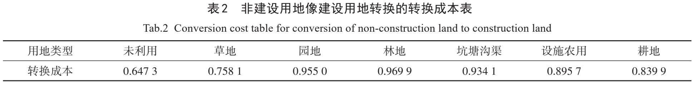

+++
draft = false
date = 2025-07-27T12:23:30+08:00
title = "【文献阅读】基于3D FLUS模型的未来SSP情景下的深圳市三维扩张模拟"
authors = ["RONGHUA LI"]
tags = ["三维扩张","FLUS模型"]
categories = ["文献阅读"]
series = ["城市扩张模拟"]

+++

# 文献信息

<table class="custom-table" style="border-collapse: collapse; font-size: 20px; margin-bottom: 30px;">
  <tr>
    <td>第一作者：丁丹</td>
    <td class="unit-cell">
        
作者单位：中山大学 地理科学与规划学院

  		
&emsp;&emsp;&emsp;&emsp;&emsp;广东省城市化与地理环境空间模拟重点实验室

    </td>
  </tr>
  <tr>
    <td>通讯作者：刘小平</td>
    <td class="unit-cell">
        
作者单位：中山大学 地理科学与规划学院

  		
&emsp;&emsp;&emsp;&emsp;&emsp;广东省城市化与地理环境空间模拟重点实验室

        
&emsp;&emsp;&emsp;&emsp;&emsp;南方海洋科学与工程广东省实验室（珠海）

    </td>
  </tr>
  <tr>
    <td>期刊：华南地理学报</td>
    <td>发表时间：2023年9月</td>
  </tr>
</table>

# 研究背景

## 研究现状

2008 年，Benguigui 等［6］提出了一个准 3D CA 仿真模型，使用包含建筑物高度信息的单元格属性并设置各种参数来模拟不同类型的城市格局。

2014 年，Lin 等［7］提出基于 GIS 的 CA 模型并设计了一个“IF-THEN”规则库。

2017 年，Koziatek 等 ［2］开发了三维地理仿真建模方法和工具 iCity 3D。

He 等 ［8］提出在水平方向上将排序元胞自动机和基于案例推理的方法相结合，垂直方向上利用反向传播人工神经网络，以预测城市的水平和垂直方向上的增长。

2021 年，Chen ［9］ 在水平方向上利用基于斑块的元胞自动机模型，垂直方向上利用随机森林模型和 K 邻近算法进行三维预测，并在不同的共享社会经济路 径 （SSP） 情景下进行模拟分析 。 

>[2]    Koziatek O, Dragicevic S.  iCity 3D: A geosimualtion method and tool for three-dimensional modeling of vertical urban development[J].  Landscape Urban Plan, 2017, 167: 356-67.
>
>**[6]    Benguigui L, Czamanski D, Roth R.  Modeling cities in 3D: a cellular automaton approach[J].  Environ Plann B, 2008, 35(3): 413-30.**
>
>[7]    Lin J, Huang B, Chen M, et al.  Modeling urban vertical growth using cellular automata-Guangzhou as a case study[J].  Applied Geography, 2014, 53: 172-86.
>
>**[8]    He Q, Liu Y, Zeng C, et al.  Simultaneously simulate vertical and horizontal expansions of a future urban landscape: a case study in Wuhan, Central China[J].  International Journal of Geographical Information Science, 2017, 31(10): 1907-28.**
>
>**[9]    Chen Y.  An extended patch-based cellular automaton to simulate horizontal and vertical urban growth under the shared socioeconomic pathways [J]. Computers Environment and Urban Systems, 2022, 91: 101727.**

2017 年，Liu 等 ［10］ 提出未来土地利用模拟 （FLUS） 模型，该模型综合考虑了自然因素和人为活动对 土地利用变化的影响，将自下而上的 CA 模型与自上而下的系统动力学模型相结合，相较于传统的 CA 模 型取得了更好的效果，目前广泛应用于各种土地利用模拟中 ［17-19］。

>[10]  Liu X, Liang X, Li X, et al.  A future land use simulation model (FLUS) for simulating multiple land use scenarios by coupling human and natural effects[J].  Landscape Urban Plan, 2017, 168: 94-116.
>
>[17]  Liu X P, Hu G H, Ai B, et al.  Simulating urban dynamics in China using a gradient cellular automata model based on S-shaped curve evolution characteristics[J].  Int J Geogr Inf Sci, 2018, 32(1): 73-101.
>
>[18]  Liang X, Liu X P, Li D, et al.  Urban growth simulation by incorporating planning policies into a CA-based future land-use simulation model[J]. Int J Geogr Inf Sci, 2018, 32(11): 2294-316.
>
>[19]  Chen G Z, Li X, Liu X P, et al.  Global projections of future urban land expansion under shared socioeconomic pathways[J].  Nat Commun, 2020, 11(1): 537.

## 存在的问题

如今各个模拟城市扩张的模型**专注于模拟城市水平扩张**，对城市三维扩张模拟的相关研究仍然非常有限，**缺少统一的理论框架**和对城市三维扩张的**驱动机制的分析和挖掘**。

**水平和垂直模拟过程割裂**

一方面，现有研究简化了模拟过程；另一方面，在进行未来的城市三维扩张模拟时，大部分研究**以二维的土地利用面积为限制条件**，这与整体的三维扩张模拟的思想不符。

三维城市扩张模拟研究**应该以建筑物体量作为需求**，每次迭代中同时进行水平和垂直方向上的扩张并计算新增城 市空间的体量，与未来体量需求进行比较，而不应该把二者割裂开。

## 研究目的

本文拟对二维的 FLUS 模型进行拓展，**以建筑物体量需求为限制**，通过挖掘平面扩张和垂直增长相结合的转换规则建立三维城市扩张的模拟模型 **3D-FLUS 模型**，并以深圳市作为研究区进行模型探究。

## 研究意义

通过模拟城市的三维扩张过程，可以更好地理解未来城市的空间演变，以及城市化对环境和人类健康的影响 ，对未来城市空间规划、促进城市可持续发展等提供理论支持和科学依据。

# 研究区域与数据

## 研究区域

深圳市（113°43'—114°38'E，22°24'—22°52'N）地处中国广东省南部、珠江口东岸，是位于中国东南部的沿海特大城市，粤港澳大湾区的核心城市之一。全市下辖9个行政区以及1个新区，包括福田、罗湖、盐田、南山、宝安、龙岗、龙华、坪山、光明区和大鹏新区，全市总面积为1997.47km²。

深圳市于1979年被指定为中国第一个经济特区，并在改革开放政策的推动下逐渐成为国际化城市。然而，随着土地资源不断开发，深圳市城市水平扩张逐渐受到制约，城市类型趋向于密集化和垂直增强并引发了一系列包括环境恶化、交通拥堵在内的社会问题。

因此，准确的三维城市扩张模拟可以帮助更好地理解深圳市的空间演变过程，对深圳市未来的城市规划以及城市气候等研究具有重要意义。

## 数据

### 土地利用数据

时间覆盖范围：2009年、2019年

空间覆盖范围：深圳市

空间分辨率：30米

数据信息：建设用地和非建设用地

数据源：高清影像目视解译结果

### 建筑物高度数据

时间覆盖范围：2009年

空间覆盖范围：

空间分辨率：5 mx5 m栅格

数据信息：建筑物层数

数据源：高德地图，经过结合高分辨遥感影像的人工校正

本文将经过结合高分辨遥感影像的人工校正的建筑物矢量数据处理为**5 mx5 m**的栅格数据，每一个栅格值代表建筑物高度的**建筑物层数**。

> 由于不同建筑物的形状不同，Lin[7]  等通过测试不同单元大小后选择20 m²作为栅格单元大小，以保证每个建筑物至少由5个单元组成。

### 空间驱动因素数据

本文的土地利用变化和建筑物高度的空间影响因素数据如表 1 中所示，主要包括：**基础地理数据、地形数据、POI 数据、OSM 路网数据、社会经济数据和规划政策数据**。

基础地理数据：包括深圳市市中心、区县中心、水系海洋、城市道路等数据；

地形数据：包括 DEM 数据和坡度数据；

8 类 POI 数据：包括商场、医院、工厂、超市、餐饮、公园、娱乐设施与公交站点；

社会经济数据：包括人口密度数据、房价数据和夜间灯光数据；

规划政策数据：主要是珠三角总体规划中的生态保护区的数据，在城市扩张的模拟过程中起到限制作用。

# 方法

## 3D-FLUS 模型结构

3D-FLUS 模型主要由两部分构成：

（1） 建立模型：通过输入 $T_0$ 时刻土地利用数据和建筑物高度数据，在每一次迭代中同时进行城市的水平扩张和垂直扩张，具体包括基于 **FLUS 模型**的水平扩张模拟获取 $T_{i+1}$ 时刻的建设用地和非建设用地，利用 **XGBoost 算法**估计 $T_{i+1}$ 时刻的建筑物高度，即可获得 $T_{i+1}$ 时刻的建筑物体量。

（2） 模型预测：首先估算未来不同 SSP 情景下的建筑物总体量，即确定未来城市的体量需求；利用所建立的模型对初始城市三维结构进行多次迭代，模拟城市逐步扩张的过程，直至满足建筑物体量需求，获取未来三维城市情景。

整体的研究流程如图 2 所示。

## 基于 FLUS 模型的水平扩张模拟

本文使用 FLUS 模型的元胞自动机部分，利用人工神经网络 （ANN） 计算特定网格单元上各土地利用类型的适宜性概率，利用自适应惯性和竞争机制模拟不同土地利用类型之间的竞争和相互作用，得到各特定网格单元上各土地利用类型发展总概率，最后在每一次迭代中通过轮盘选择确定新的土地利用类型。其具体公式如下：
$$
TP_{p,k}^{t} = P_{p,k} \times \Omega_{p,k}^{t} \times \text{Interia}_{k}^{t} \times \left(1 - con_{c \to k} \right)
$$
其中，$P_{p,k}$ 为土地利用类型 $k$ 的**适宜性发展概率**，由ANN计算获得；$\Omega_{p,k}^{t}$ 为**邻域因素**，表示在迭代时间 $t$,
某一个网格单元$p$上土地利用类型$k$的邻域影响大小；$\text{Interia}_{k}^{t} $ 为**惯性系数**，在三维城市模拟模型中该惯性
系数主要根据未来建设用地的建筑物体量需求制定；$con_{c \to k}$ 为**转化成本**，代表一个网格单元的某一种土地
利用类型 $c$，向另一种土地利用类型 $k$ 转换的难易程度。得到总体概率 $TP_{p,k}^{t} = P_{p,k} $ 后通过转盘竞争判断该土地利用类型最终的转化情况。

### 邻域因素

迭代时间 $t$，某一个网格单元 $p$ 上土地利用类型 $k$ 的邻域影响的公式表示为：
$$
\Omega_{p,k}^t =  \frac{ \sum\limits_{N \times N} \text{con}(c_p^{t-1} = k)}{N \times N - 1} \times w_k
$$
其中，$w_k$ 为不同土地利用类型间的权重值，$\sum\limits_{N \times N} \text{con}(c_p^{t-1} = k)$ 为在 $N \times N$ 的窗口内，土地利用类型 $k$ 在上一次迭代时间 $t-1$ 所占用的网格总数。

### 惯性系数

FLUS 模型中的惯性系数表示原有土地利用类型的继承，根据**未来土地利用需求和当前土地利用数量的差异**进行迭代变化。在三维城市模拟模型中，该惯性系数主要根据未来建设用地的建筑物体量需求来制定，计算公式如下：
$$
\text{Interia}_k^t =
\begin{cases}
\text{Interia}_k^{t-1}, & \text{if } |D_k^{t-1}| \leq |D_k^{t-2}| \\
\text{Interia}_k^{t-1} \times \dfrac{D_k^{t-2}}{D_k^{t-1}}, & \text{if } D_k^{t-1} < D_k^{t-2} < 0  \\
\text{Interia}_k^{t-1} \times \dfrac{D_k^{t-1}}{D_k^{t-2}}, & \text{if } 0 < D_k^{t-2} < D_k^{t-1}
\end{cases}
$$
其中，$D_k^{t-1}$ 表示在 $t-1$ 时刻未来目标体量需求与当前体量需求之间的差异。在不同迭代时刻根据建筑物体
量的变化可以对惯性系数大小做出适时调整，直到与未来的体量需求相匹配。

### 转化成本

$con_{c \to k}$ 转化成本是针对一个网格单元的某一个土地利用类型，向另一个土地利用类型转换的难易程度，可根据专家经验和当地的规划情况调整。

在本研究中对非建设用地的类别进行详细的划分，例如草地、林地、耕地、园地等。各个类别转化为建设用地的成本不同，例如林地转化为建设用地的成本较高，而耕地转化为建设用地的成本相对较低。结合实际情况，利用层次分析法（AHP）计算各非建设用地类型转化为建设用地的转化成本如表2，其中转换成本值越大代表转化难度越大。

## 基于 XGBoost 算法的垂直扩张模拟

建筑物高度变化为连续型变量，本文采用 XGBoost 算法进行建筑物高度的**回归预测**。XGBoost 算法是梯度提升树模型的一种，相比于经典的梯度提升树模型，XGBoost 算法通过将目标函数的泰勒展开到二阶，增加自动处理缺失值特征的策略，加入正则化项提升性能［20］，更适合于复杂的高度预测回归问题。

> [20] Chen T, Guestrin C.  XGBoost: A Scalable Tree Boosting System; proceedings of the the 22nd ACM SIGKDD International Conference, F, 2016[C].

其本质是从优化第一棵树开始，通过不断添加新的树学习一个新函数 $f ( x ) $ 来拟合上一次迭代中模型的残差，公式如下：
$$
\hat{y}_i^t = \hat{y}_i^{t-1}+f_i(x_i)
$$
XGBoost 算法的目标函数计算公式如下：
$$
\Omega(f) = \gamma T + \frac{1}{2} \lambda \|u|^2
$$

$$
\text{Obj}(\theta) = \sum_{i=1}^{n} l(y_i, \hat{y}_i) + \sum_{i=1}^{K} \Omega(f_k)
$$

其中，$l$ 为度量样本真实标签 $y_i$与样本预测标签 $\hat{y}_i$ 之间的误差的损失函数，$\Omega$ 为度量模型的复杂度的正则化项，$T$ 为叶子的节点数，$\lambda$ 为惩罚系数，$u$ 为叶子节点的分数组成的集合。

## 建筑物体量需求估算

为更加符合城市三维扩张的思想和逻辑，本文计算在**不同 SSP 情景下的建筑物体积需求**作为城市扩张迭代过程停止的条件。

通过预测未来不同 SSP 情景下**人口总数**，结合已有规划政策设置**人均建筑面积**，最终得到不同 SSP 情景下的**建筑物体积需求**，公式如下：
$$
\text{Demand}_\text{volume} = P × S × C
$$
其中，$C$ 为常数，代表一层建筑物的平均高度，通常认为是 3 m。$P$ 为某一 SSP 情景下的某一时刻的人口总数，$S$ 代表某一时刻的人均建筑面积。

## 模型验证

3D-FLUS 模型的准确性主要从模型**算法**以及模型**模拟结果**两部分进行评估。其中，模型算法评估包括水平扩张方向 ANN 算法以及垂直扩张方向 XGBoost 回归算法验证；模型模拟结果验证包括二维方向模拟结果和三维体量模拟结果验证。

### 算法评估

**ANN算法的适宜性发展概率**

本文利用受试者工作特征曲线（ROC曲线）和ROC曲线下面积（AUC）值［21]量化 ANN 算法模拟建设用地和非建设用地的适宜性发展概率结果和实际土地利用分布的匹配性。

ROC 曲线下的面积 （AUC） 的取值一般在 0.5 到 1 之间，AUC 值越大代表模型的性能越好。

**XGBoost 算法的建筑物高度**

本文选取回归常用的精度评估指标包括决定系数 R、均方根误差 RMSE、平 均绝对误差 MAE，公式如下：
$$
R = \sqrt{1 - \frac{ \sum_{i=1}^n (y_i - \hat{y}_i)^2 }{ \sum_{i=1}^n (y_i - \bar{y})^2 }}
$$

$$
\text{RMSE} = \sqrt{ \frac{1}{n} \sum_{i=1}^n (y_i - \hat{y}_i)^2 }
$$

$$
\text{MAE} = \frac{1}{n} \sum_{i=1}^{n} | y_i - \hat{y}_i |
$$

式中，$y_i $为第 $i$ 个建筑单元的真实建筑高度，$\hat{y}_i$ 为第 $i$ 个建筑单元的预测建筑高度，$\bar{y}$ 为所有建筑单元真实高度的平均值，**所有高度的单位都为层数**；$n$ 为所有建筑物的数量。

R值越大，预测效果越好。RMSE和MAE值越小，代表预测结果和真实结果的差距越小，预测效果越好。

### 模拟结果验证

**二维方向模拟结果**

本文选取总体精度 （OA）、Kappa 系数和 FoM 指数来定量化评估模型二维方向上的模拟结果，有研究表明 FoM 指数在评价模拟变化的准确性上优于 Kappa 系数[22]。FoM 计算公式如下：
$$
\text{FoM} = \frac{B}{A + B + C + D}
$$
式中，$A$ 为真实情况变化但模拟不变的数量；**$B$ 为真实情况变化以及模拟发生变化的数量**；$C$ 为真实情况变化但模拟变化不一致的数量；D 为真实情况未改变但模拟改变的数量。

>[22]  Pontius R G, Boersma W, J-CCASTELLA, et al.  Comparing the input, output, and validation maps for several models of land change[J].  The Annals of Regional Science, 2008, 42(1): 11-37.

**三维体量模拟结果**

针对二维方向上模拟扩张与实际扩张位置一致的像元，统计各像元建筑物模拟体量值与实际体量值的 $\text{RMSE}$ 和相对误差大小，以评估三维体量结果的准确性。

# 结果与讨论

## ANN 算法实现与验证

### 算法实现

驱动因子：从区位交通、POIs 等数据中选取 22 个驱动因子

预测类别：初始土地利用数据为建设用地和非建设用地两种类型

数据预处理：所有数据统一采样至30 m×30 m，并对驱动因子数据进行归一化处理

模型结构：ANN 算法的输入层包含 22 个神经元 （对应 22 个空间驱动因子），输出层包含 2 个神经元 （对应 2 种土地利用类型）。

数据集：针对 2019 年深圳市建设用地和非建设用地数据各选取 40 000 个样本点，其中 80% 用于训练， 20% 用于验证。将建设用地类型设为正样本，非建设用地类型设为负样本。

### 结果验证

根据 ROC 曲线计算 AUC 值为 0.86，表明土地利用的发展概率可以通过选定的驱动因素较好地表达，且 ANN 算法所模拟建设用地和非建设用地的适宜性发展概率结果与实际土地利用分布具有较高的一致性。

## XGBoost 算法实现与验证

### 算法实现

驱动因子：结合深圳市实际情况，从社会经济数据和区位交通数据中选取 23 个影响建筑物高度的空间因素

### 结果验证

绘制建筑物高度真实值和预测值的散点图并计算 RMSE、MAE 和 R 值，结果如图 4 所示。

由于 RMSE 受到建筑物高度范围的明显影响，故分别计算低于 10 层建筑物与高于 10 层建筑物的 RMSE 结果，以减弱高层建筑对 RMSE 的影响。

测试集中，整体建筑物高度的 RMSE 值在 4 层建筑物左右，其中 10 层以下建筑物的 RMSE 为 2 层左右，10 层以上建筑物的 RMSE 为 10 层左右。

训练集的 R 为 0.97，MAE 为 1 层左右；测试集的 R 为 0.87，MAE 为 2 层左右，证明预测结果和真实值之间有较好的一致性，XGBoost 算法可以较好解释建筑物的平均高度。

## 二维模拟验证

本文利用 3D-FLUS 模型模拟 2019 年深圳市的三维空间情景，并与 2019 年深圳市真实三维数据进行对比。

2019 年模拟结果和真实土地利用变化完全**一致的区域发展形势多为填充式扩张**，**真实发生变化但模拟未变化的部分则大多出现在区域边缘位置**，这与区位条件和适宜性概率计算结果相关。相比于飞地式扩张和边缘式扩张，建设用地呈填充式扩张的发展概率更高，这意味着**城市的发展更容易发生填充式扩张**。

> 飞地型城市化是一种城市扩展方式，其新扩展区域在空间上与原有建成区断开，但在职能上仍与中心城市保持联系。这种现象常见于大城市的郊区，例如卫星城的建设。与外延型城市化不同，后者表现为连续渐次向外推进，而飞地型城市化强调空间分离下的职能连接。[飞地型城市化_百度百科](https://baike.baidu.com/item/飞地型城市化/3284401)

计算二维模拟结果的定量评价指标，FoM 值为 0.3473，总体精度结果为 95.14%，Kappa 系数为 0.8879，证明 模拟数据和真实数据较高的相似性，该模型在二维空间位置的模拟结果较好。

## 三维体量验证

针对从 2009 年到 2019 年二维扩张位置完全正确的像元，统计各像元的建筑物体量值，计算单元建筑物体量真实结果与模拟结果之间的 RMSE 值。

实际上部分建筑物高度范围较大，最大单元体量的 RMSE 值在 1 万 $m^3$ 左右，而实际新增最大单元建筑物体量达 12 万  $m^3$，相对误差大小为 10%，所以模拟结果误差较小。

## 未来城市三维空间扩展模拟

本文以 2019 年深圳市三维空间情景为基础，利用所构建的 3D-FLUS 模型，模拟在 2029 年 5 种 SSP 情 景下深圳市三维空间情景。

### 体量需求预测

本文**参考已有研究所预测的未来广东省人口数**，该数据依据2010年中国不同省份的年龄、性别、受教育程度的人口统计信息，考虑开放二胎政策和限制超大城市人口上限的政策，设置 5种 SSP 情景下的生育率、死亡率、迁移率、升学率，预测2010年到2100年每一年各个省份人口数［23］。

>[23]  Chen Y D, Guo F, Wang J C, et al.  Provincial and gridded population projection for China under shared socioeconomic pathways from 2010 to 2100[J].  Scientific Data, 2020, 7(1): 83.

根据 2019 年深圳市实际总人口数和广东省实际总人口数的比例，预测 2029 年不同 SSP 情景下的**深圳市人**
**口数**，并依据《深圳市国土空间总体规划（2020一2035年）》、《深圳市商业网点规划（2016一2020）》以及《深圳统计年鉴》，结合2019 年真实三维体量数据**估计2029 年人均建筑面积**，进而**计算未来建筑物体量**。

### 二维预测结果

图 6 显示了深圳市在 2029 年 5 种 SSP 情景下的水平方向空间格局。

相较于其他 SSP 情景，**SSP1 情景呈现以边缘式和填充式为主**的扩张趋势，以及飞地式发展明显减少、土地利用破碎度较低的发展特点。产生该现象的原因为 SSP1 是一种可持续发展 情景，教育和卫生投资促进人口转变导致中国人口相对较低，同时城市发展将会呈现出紧凑的发展特点。 尽管 SSP1 同样属于快速发展场景，但相对于 SSP5 对环境更加友好，所需要的建筑物体量相对较小。

**SSP5** 则是一种快速发展的情景，在高化石燃料消耗发展下将在卫生、教育等方面投入大量资金，人口在一定程度上会快速增长，所需建筑物体量也快速增大。同时城市发展呈现出扩张型发展的极端化发展，体现在**土地利用的破碎程度增大，存在较多飞地式发展**。

**SSP3 和 SSP4** 所模拟的城市土地利用的位置相对分散，表现为相对宽松的土地控制，土地破碎化程度位于 SSP1 和 SSP5 之间。

而SSP2情景是一种延续历史发展的情景，代表一种"中间路线"，模拟的土地破碎化程度要高于 SSP1情景，但明显低于 SSP5 情景。

### 三维预测结果

由图 7 和图 8 的三维扩张结果可知，**新增的建设用地上主要开发 5 层以下的低层建筑**， 有少量高层建筑被开发。

深圳市整体的建筑物高度分布**由北向南体现为逐渐增高的趋势**，**由西向东呈现出逐渐降低的趋势**，靠近南部市中心区域建筑物层数较高，这与深圳市实际情况相符。深圳市中心城区福田区、以及深圳市最早开发的罗湖区是深圳市的金融中心，同时深圳市南山区是深圳的科研、教育和体育中心，均位于深圳市南部区域。事实上，这些区域在未来也将发展较高层的建筑。

由局部区域 A 可知，**深圳市南部新增建设用地以 5 层到 15 层的中层建筑为主**，而局部区域 B 显示在**深圳市北部远离市中心位置，新增的建设用地主要是 5 层以下的低层建筑**，这也表明**建筑物的高度和经济发展程度存在一定的正向关系**。

# 结论

3D- FLUS 模型在**水平方向**建设用地的模拟中，FoM 指数为 0.34，Kappa 系数为 0.887 9，总体精度为 95.14%，**垂直方向**上各建筑物体量的相对误差小于等于 10%，拟合误差较低。

SSP5 情景下建筑物体量需求最大，且城市化进程较快，人口快速增长，土地利用破碎化程度较高。

SSP1 情景代表在可持续发展的条件下对环境较为友好，深圳市趋向于紧凑性的内部填充式扩张。

SSP2 代表深圳市将延续之前较为高速的发展情景，所需要的建筑物体量需求也较大。

SSP3 和 SSP4 情景代表在不平等的发展下，城市经济受到影响，人口数量较少，建筑物体量需求较低，城市发展土地政策较为宽松。

2029 年新增的建筑物高度以中低层建筑为主，在深圳市南部地区新增少量高度较高的建筑物，而北部地区新增建筑物高度相对较低。

# 本文主要贡献与不足

## 贡献

提出一种以二维 FLUS 模型为基础的 **3D-FLUS 模型**，挖掘平面扩张和垂直增长相结合的转换规则建立的三维城市扩张的模拟模型，解决以往研究中**水平和垂直模拟过程割裂**，仅以二维土地利用面积为需求限制模拟三维情景的问题，其逻辑更加符合城市三维扩张的实际情况。

对未来不同 SSP 情景下城市三维空间模拟，解决了现有大部分模型在垂直方向上模拟简单化，缺少对未来不同情景的三维城市模拟的问题。

## 不足

本文指出已有研究在**水平和垂直模拟过程割裂**的现象，但没有举例说明。

层次分析法（AHP）未明确介绍。

ANN 算法使用的 22 个驱动因子未详细说明。

XGBoost 算法进行建筑物高度回归预测的过程未详细说明

模型使用的训练数据未明确描述，2009年的数据如何使用未交代清楚。

从 2009 年到 2019 年的三维体量验证未给出与真实情况的对比结果图，也未进行分析。
