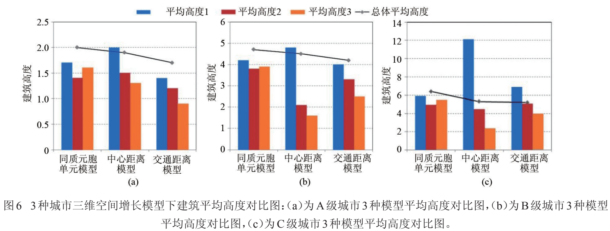

+++
draft = false
date = 2025-07-26T16:51:50+08:00
title = "【文献阅读】基于元胞自动机的城市三维空间增长仿真模拟"
authors = ["RONGHUA LI"]
tags = ["CA", "城市三维扩张"]
categories = ["文献阅读"]
series = ["城市扩张模拟"]

+++

# 文献信息

<table class="custom-table" style="border-collapse: collapse; font-size: 20px; margin-bottom: 30px;">
  <tr>
    <td>第一作者：秦静</td>
    <td class="unit-cell">
        
作者单位：中国科学院地理科学与资源研究所

  		
&emsp;&emsp;&emsp;&emsp;&emsp;中国科学院大学

    </td>
  </tr>
  <tr>
    <td>通讯作者：方创琳</td>
    <td class="unit-cell">
        
作者单位：中国科学院地理科学与资源研究所

    </td>
  </tr>
  <tr>
    <td>期刊：地球信息科学学报</td>
    <td>发表时间：2013年10月</td>
  </tr>
</table>

# 研究背景

## **元胞自动机（CA）模型的特点**

元胞自动机（CA）模型的特点是局部规则（local rules）导致系统全局变化（global change），很好地体现了城市的自组织性特点。

## **城市 CA 模型在三维扩张模拟较少**

目前，城市 CA 模型在结构上、逻辑上和表现形 式上多是二维空间，对城市立体空间扩展的研究较少。

Bengguigui等的城市空间三维元胞自动机（3DCA）模型，用不同参数模拟了城市发展的不同阶段并作出合理解释，但是并没有对模型进行三维的可视化，而是使用颜色来区分不同楼层的高度，这种表达有失精确性和直观性，并且其在建立城市模型时**将元胞空间即城市发展的空间视为是同质的**，这与真实城市（不同区域具有异质性）相悖[19]。

> [19] Benguigui L, Czamanski D, Roth R. Modeling cities in 3D: A cellular automaton approach[J]. Environment and Planning B: Planning and Design, 2008,35(3):413-430.

张乐珊对 Bengguigui 模型 进行了三维显示，并结合多主体模型对英国东南部 沿海 Cromer 镇进行了城市三维空间增长模拟，但是其**并没有对 Bengguigui 模型进行实质的改进**[11]。

> [11] 张乐珊.基于元胞自动机和 VR-GIS 技术的城市空间增 长 三 维 动 态 模 拟 及 应 用 研 究 [D]. 青 岛: 中 国 海 洋 大 学, 2010.

# 城市空间增长三维元胞自动机模型

## 三维元胞自动机定义

三维元胞空间可以用底面的正方形**格网和高度**来表示。元胞空间的高度取值大于或等于建筑物的最高高度，其中**建筑物高度以楼层数表示**，最高楼层设定为 30 层，该数值可以根据实际情况设定。

任一立体元胞的索引可以表示为 $Cell_{x,y,h}$ ，其中，$(x,y)$ 为平面坐标，$h$ 为楼层数值。

元胞的邻域定义为 **Moore** 邻域，即与该元胞直接相邻的 8 个元胞单元。

在三维元胞空间中，每一个立体元胞可以表示一个单体建筑或一个同质的建筑群块。

## 城市空间增长模型的构建（建模依据）

城市三维空间增长模型，是以城市发展的自组织理论为理论基础，其建模的依据：

（1）城市空间系统具有与生命个体类似的特征，在模型中可将土地单元（元胞单元）类比为城市生命系统的细胞，**每个土地单元都具有生长的潜力**。
（2）城市三维空间形态的变化具有**空间上不连续性和时间上不一致性**。
（3）城市三维空间形态主要由不同形式的**三维建筑集簇**组成。三维建筑集簇可以定义为一定数量的空间上相邻接的具有**相似高度的建筑单元聚集体**。
（4）城市三维空间的发展演变是**跳跃式**的过程。三维建筑据集簇最初开始在某个特定位置形成，发展一段时间后，可能又会在新的位置形成建筑聚集簇，故城市的发展可以看做是**不断形成三维建筑聚集簇**的过程。
（5）距离**城市中心**越近，地块区位越好，人口密度越高，城市中建筑发展为高层的概率越高。
（6）距离**交通线路**越近，地块区位越好，地皮价格越高，城市中建筑发展为高层的概率越高。

其中，前 4 项为 Benguigui 城市空间增长模型的假设条件，它**将城市空间视为无差异的地理表面**， 即在一块没有区位差异的土地上建设一个城市，在其模型中**所有的元胞单元均为同质的，具有相同的发展概率**，没有考虑不同的元胞单元之间的异质性。

本文建模时**考虑到不同元胞单元之间的异质性**，增加了中心距离（距离城市中心的距离）和交通距离两个影响因素，以求更加精确地模拟真实城市 空间增长过程。

> 本研究的改进点：用中心距离和交通距离两个影响因素来考虑到不同元胞单元之间的异质性。

## 模型的评价因子（建模因子）

参考了城市经济学、城市地理学基本理论和市场规律，并借鉴了 Bengguigui 城市空间增长三维元胞自动机模型（3DCA）模型，城市发展密度元胞自动机模型[26]、约束性单元自动演化 CA 模型[27-28]等二维城市空间扩展模型。

> [26] 黎夏,叶嘉安.基于元胞自动机的城市发展密度模拟[J]. 地理科学,2006,26(2):165-172.
>
> [27] 黎夏,叶嘉安.约束性单元自动演化 CA 模型及可持续城市发展形态的模拟[J].地理学报,1999,54(4):289-298.
>
> [28] Li Xia, Yeh A G O. Modelling sustainable urban develop- ment by the integration of constrained cellular automata and GIS[J]. International Journal of Geographical Infor- mation Science, 2000, 14(2):131-152.

模型共设置 6 个评价因子：初始覆盖率（IC），惯性因子（IF），邻域交互因子（IN），噪声因子（NS），中心距离因子（CD），交通距离因子 （TD）。

三维城市空间增长模型公式如下所示。
$$
3DCA = f (IC, IF, IN, NS, CD, TD)
$$
（1）初始覆盖率（IC）：城市发展的最初形态。
（2）惯性因子（IF）：表达了在特定的地理区域中，城市空间增长过程的**连续性**和自组织性。**如果某个建筑单元在某一时刻发生增长，那么这个建筑单元在下一时刻将具有继续增长的惯性**。惯性因子是对经济地理学中规模经济效应的部分反映。
（3）邻域交互因子（IN）：表达了土地单元邻域内建筑开发活动对该土地单元的影响作用， **如果某土地单元邻域内建筑开发达到一定比例，那么该土地单元在下一时刻被开发的概率将会大大增加**。邻域交互因子是城市发展的自组织集聚效应的表现，是人们交往活动需要、规模效益要求等多种因素的综合反映。
（4）噪声因子（NS）：反映了城市发展中的不确定因素或人为干预因素，可以用来表示**城市发展政策、城市规划决策等对城市发展的影响**。噪声因子在模型中是**不可控的随机参数**，与其他因素和过程不相关。
（5）中心距离因子（CD）：表达了**人口密度**对城市建筑增长的影响，距离城市中心越近，人口密度越高，对建筑物容积率的要求也越高，建筑物增长为高层的概率也越高。
（6）交通距离因子（TD）：该因子表达了交通因素对城市建筑增长的影响，**距离主要交通路线越近**，地区的通达性越好，其邻近的**土地单元被开发的概率也越高**。

## 评价函数及规则

### 评价因子取值方式

在城市仿真模型中，**初始覆盖率 IC 是一个概率值，可由用户自行设定**，模拟的初始化阶段，将按照用户设定的概率随机向三维元胞空间添加高度为 1 的建筑物（模型中建筑物的初始高度设置为 1 层）。

其他 5 个评价因子 $(IF, IN, NS, CD, TD)$ 的取值均为二进制值 0 或 1。

元胞单元 $Cell_{x,y,h,t}$ 在 $t$ 时刻评价因子取值的计算方法：

**（1）惯性参数（ $IF$ ）**

如果 t = 0 ，惯性值取值为 1 的概率取决于初始覆盖率。
$$
F(x, y, h, 0) = 
\begin{cases}
1, & \text{if } p = IC \\
0, & \text{if } p = 1 - IC
\end{cases}
$$
当 $t ≠ 0$ 时，惯性参数的取值取决于 $t - 1$ 时刻元胞的建筑高度变化 $Δh$ 。
$$
IF(x, y, h, t) = 
\begin{cases}
1, & \text{if } \Delta h(x, y, t - 1) \neq 0, \, p = i \\
0, & \text{if } \Delta h(x, y, t - 1) = 0
\end{cases}
$$
**如果 $Δh ≠ 0$ ，惯性参数以 $p = i$ 的概率赋值为 1**；如果 $Δh = 0$ ，惯性参数取值为 0。

**（2）邻域交互参数（$IN$）**

元胞邻域取 Moore 邻域，设定一个阈值 $n(0≤n≤8)$ ， 通过比较 $t - 1$ 时刻邻域内出现增长 ($Δh = 1$) 的元胞 数量与阈值 $n$ 的大小来决定邻域交互参数的取值， 如果大于或者等于阈值，则 $IN$ 取值为 1，否则取值为 0。
$$
IN(x, y, h, t) = 
\begin{cases}
1, & \text{if } \sum \Delta h(x, y, t - 1) \geq n,\quad 0 ≤ n ≤ 8 \\
0, & \text{if } \sum \Delta h(x, y, t - 1) < n,\quad 0 ≤ n ≤ 8
\end{cases}
$$
**（3）噪声参数（$NS$）**

噪声参数在模型中与其他参数和过程相互独立，它的取值是由噪声概率 $η$ 决定。

在模型初始化阶段设置噪声参数后，整个运算过程中噪声参数不受其他因子变化的影响，噪声参数取值为 1 的概率为 $η$ ，取值为 0 的概率为 $1 - η$ 。
$$
NS(x, y, t) = 
\begin{cases}
1, &  p = \eta \\
0, &  p = 1 - \eta
\end{cases}
$$
**（4）中心距离参数（ $CD$ ）**

人口密度随着远离市中心而衰减， 可利用密度的衰减函数来表达这种关系[29] ： $Den_i = Ae^{-βx_i}$，这里 $Den_i$为密度，$x_i$ 为离中心的距离，$A$ 和 $β$ 为衰减函数的参数。

> [29] Clark C. Urban population densities[J]. Journal of the Royal Statistical Society, Series A (General), 1951,114(4): 490-496.

中心距离参数值取 1 的概率参照密度衰减函数定义为 $p = Ae^{-β(x^2+y^2)^{1/2}}$ ，其中，元胞距离中心的距离为 $(x^2+y^2)^{1/2}$，$A$ 和 $β$ 为常数参数。
$$
CD(x, y, t) = 
\begin{cases}
1, &  p = A e^{-\beta (x^2 + y^2)^{1/2}} \\
0, &  p = 1 - A e^{-\beta (x^2 + y^2)^{1/2}}
\end{cases}
$$
**（5）交通距离参数（ $TD$）**

 元胞单元随着距离交通道路的距离增加，参数值取 1 的概率呈线性衰减，即元胞值取为 1 的概率为 $p = (z - d_{min})/(d_{max} - d_{min}) $，其中，z 为元胞距交通道路的距离，$z = (x^2 + y^2)^{1/2} $，$d_{min}$ 与 $d_{max}$ 分别为距离交通道路的最近距离和最远距离。
$$
TD(x, y, t) = 
\begin{cases}
1, & p = \frac{d_{max} - z}{d_{max} - d_{min}} \\
0, & \text{otherwise}
\end{cases}
$$

> 原论文公式错误❌

### 评价函数

本文中元胞状态转换规则是由元胞生长潜力评价函数 $f$ 决定，函数 $f$ 是一个**布尔离散函数**，由上述 6 个参数的取值决定。

元胞单元 $Cell_{x,y,h,t}$ 在 $t$ 时刻的评价函数 $f$ ：
$$
f_0(x, y, h, t) = IF(x, y, h, t) + IN(x, y, h, t) + NS(x, y, t) \\
f(x, y, h, t) = 
\begin{cases}
1, & \text{if } f_0(x, y, h, t) \geq 2 \\
0, & \text{if } f_0(x, y, h, t) < 2
\end{cases}
$$

$$
f_1(x, y, h, t) = IF(x, y, h, t) + IN(x, y, h, t) + NS(x, y, t) + CD(x, y, t) \\

f(x, y, h, t) = 
\begin{cases}
1, & \text{if } f_1(x, y, h, t) \geq 3 \\
0, & \text{if } f_1(x, y, h, t) < 3
\end{cases}
$$

$$
f_2(x, y, h, t) = IF(x, y, h, t) + IN(x, y, h, t) + NS(x, y, t) + TD(x, y, t)\\

f(x, y, h, t) = 
\begin{cases}
1, & \text{if } f_2(x, y, h, t) \geq 3 \\
0, & \text{if } f_2(x, y, h, t) < 3
\end{cases}
$$

公式（8）为城市每个土地单元均为同质的情况下，元胞状态转换规则，当 $IF ，IN ，NS$  3 个 参数中有 2 个或者 2 个以上时取值为 1，则评价函数 $f$  取值为 1，表明城市会进行新的增长，其余情况 $f(x, y, h, t) =0$，即城市不作改变保持现状 。

公式（9）和（10）分别为加入中心距离参数与交通距离参数后，城市土地单元异质的情况下，元胞状态转换规则。在公式（8）中，当 $IF ，IN ，NS ，CD$  4 个 参数中有 3 个或者 3 个以上同时取值为 1，则评价函数 $f$  取值为 1，其余情况 $f(x, y, h, t) =0$；在公式（9）中当 $IF，IN，NS，TD$  4 个参数中有 3 个或者 3 个以上同时取值为 1，则评价函数 $f$  取值为 1，其余情况 $f(x, y, h, t) =0$。

## 基于评价结果计算建筑高度

如果元胞单元 $Cell_{x,y,h,t}$ 的生长潜力函数值为 1，那么高度 $h$ 会在前一时刻高度的基础上增加 $Δh$ 。$Δh$ 的值可以根据实际需要取一层或者多层， 本文中取 $Δh = 1$。

建筑高度计算公式如下:
$$
h(x, y, t) = h(x, y, t - 1) + f(x, y, t - 1)\\
h(x, y, t) \leq h_{\max}, \; t \leq T
$$
其中，$h_{max}$ 为建筑增长的最高高度限制，本文取 $h_{max}=30$ ，当建筑高度增长达到 30 时，则该建筑停止增长，$T$ 为模型运行的时间，即模型达到稳定状态时系统运行的时间。

# 基于 NetLogo 3D 的实验设计

## 仿真平台

利用仿真平台开发仿真模型是解决复杂系统问题的重要技术途径之一，常见的仿真平台主要有 **Swarm、NetLogo、RePast、Mason 和 AnyLogic** 等，每种平台在内部建模机制、模型表现能力和提供的科学支持能力等方面各有特色。

本文选用 NetLogo 作为城市三维空间增长的建模工具。

**NetLogo 平台**

采用的 Logo 程序语言包括许多高层结构，可有效节约程序编制的时间；

Netlogo 模型能够在多种主流平台上运行（Mac、Windows、Linux 等）；

NetLogo 的建模思想具有**元胞自动机和多主体系统的双重理论基础**，有效结合了两种建模思想的优势，特别适合对随时间演化的复杂系统进行建模；

NetLogo 是由 Uri Wilensky 在 1999 年发起的，由连接学习和计算机建模中心 (CCL)负责持续开发[30]。

NetLogo 自版本 4.0.2 后添加了 NetLogo 3D 建模工具，能够进行三维元胞自动机建模。

## NetLogo 中的智能体

分为 3 类：海龟（turtles）、块（patches）和观察员（observer）。

前两类智能体构成了整个仿真世界， 观察员可以观察和控制仿真世界的运行。

**二维世界（NetLogo 2D）**

**海龟**（xcor, ycor）可代表现实世界中**有活动特性的物体**，如一个人、一辆汽车等； 

**块**（pxcor, pycor）则代表了海龟所生存的**环境**，若干个块构成整个环境，如一条道路、一个城市等。 

**NetLogo 3D** 

仿真世界由小正方体组成。

**块** （patches）是小的正方体，除了二维中拥有 x, y 坐标 外，还有表示高度的 z 坐标，因此，一个块的位置可以表示成（pxcor, pycor，pzcor）；

**海龟**也拥有三维坐标（xcor, ycor, zcor）。

## NetLogo3D 三维建模视图

不同于 Bengguigui使用不同的颜色在平面上表示三维图像，本文设置了二维，三维两种视图。 

在 NetLogo3D 中一个元胞可以表示单个的建筑，也可以表示一个同质的建筑群块。

本文定义建模空间（元胞）的大小为 80×80×80，选取楼层数为 30，当建筑层数增长达到 30 时，该建筑停止生长。

NetLogo3D 建模的界面如图 1 所示。

4 个用户决定的参数：初始覆盖概率，惯性参数，邻域交互参数的阈值，噪声参数；

2 个系统设定的参数：中心距离、交通距离参数；

一个图表，即建筑平均高度随时间变化图表；

一个监视器，即建筑平均高度数值的监视器。

本文中 NetLogo 3D 建模流程如图 2 所示，其中，虚线框内的步骤是一个仿真周期（to go）， 元胞（patches）经过多个周期的生长，直到最后不再变化，达到稳定状态结束。

## 三维城市空间增长仿真模拟实验的设计

**（1）设定 3 种仿真实验的情景**

一是将整个城市地表面视为无差异的地表面，不同的地区拥有相同的区位，即元胞空间为无差异元胞空间，即同质元胞单元模型；

二是在第一种仿真情景的基础上加入中心距离因子，即**中心距离**模型；

三是在第一种仿真情景基础上加入交通距离因子，即**交通距离**模型。

**（2） 参数设置**

对每种情景仿真**尝试不同的参数设置**，观察形成的城市空间结构，并按照不同的建筑高度和建筑集簇的空间分布特点将仿真实验结果分成不同级别的城市三维空间形态。

**（3）结果分析**

对比分析 3 种模型仿真模拟结果，分析增长形态的差异。

# 实验结果及分析

## 建筑层数定义

**住宅设计规范 GB50096-1999**

低层住宅为 1-3 层，多层住宅为 4-6 层， 中高层住宅为 7-9 层，高层住宅为 10 层及以上。

**本文定义**

低层建筑：1-6 层的低层和多层建筑，使用红色表示；

中层建筑：7-12 层，使用黄色表示；

高层建筑：12-18 层，使用橙色表示；

超高层建筑：18 层以上，使用蓝色表示。

## 城市等级的划分

通过对最初的同质元胞单元，与分别加入中心距离参数和交通距离参数 3 种情况下城市三维空间增长过程进行仿真模拟实验。仿真实验中选取不同的参数组合，可以产生形态各异的城市三维空间建筑分布。

参照 Benguigui 等模型中城市等级的划分，根据到达稳定形态时建筑高度和建筑集簇的分布特点，对实验结果进行了划分，各等级划分方法如表 1 所示。

A 级城市代表了还处于初级发展阶段的城市，是城市从初始低平形态向高层现代城市发展 的最初状态 。 

B 级城市代表了城市发展的中级阶段，处于城市由初级向高级转化的中间状态。

C 级城市表现出于与现代都市类似的空间秩序，比如，现代都市中通常会在中心 CBD 及其他特定区域形成商业建筑群和住宅建筑群等高层建筑聚集群。

## 实验结果

### A 级城市

如表 2 所示，A 级城市的生成用较小的惯性参数、邻域交互阈值和噪声参数。

结果如图 3（a）与 3（b），图 4（a）与 4（b），图 5（a）与 5（b）所 示 。 

在 A 级城市中，3 个仿真实验中均只有少数的建筑生长，仍存在较多空地，大多数建筑都还是保持初始状态的高度，仿真过程中高层建筑没有出现。

表 3 总体平均楼层高度在 1-2 之间。

图 3（a）与 3（b）中建筑物在仿真空间中**随机**生长和填充；而图 4（a）与 4（b） 中，城市**中心区域**生长和填充的概率较大，向外部则逐渐递减；图 5（a）与 5（b）中，**沿街道**的土地单元建筑生长和填充的概率较大，远离街道则逐渐递减。

### B 级城市

如图 3（c）与 3（d），图 4（c）与 4（d），图 5（c）与 5（d）所示。

在 B 级城市中，建筑数量与建筑层数较 A 级有较多增加，出现了较多中层建筑的集簇，有少量高层建筑，但是高层建筑基本彼此分离，**没有形成明显的高层建筑集簇**，没有超高层建筑。

如表 2所示，B 级城市的生成用较高的惯性参数、邻域交互阈值和噪声参数。

平均楼层高度在 4-5 之间（表 3 总体平均高度）。

图 3（c）与 3（d）中，中层建筑物**随机**分布在仿真空间；图 4（c）与 4（d）中，中层及 高层建筑集簇主要出现在了城市**中心**区域附近，其他区域则较少；图 5（c）与 5（d）中，中层及高层建筑集簇沿**街道**分布，离街道较远处则出现较少。

### C 级城市

如图 3（e）与 3（f），图 4（e）与 4（f），图 5（e）与 5（f）所示。

在 C 级城市中，出现高层建筑的数量有显著增加，并且**形成大量高层建筑集簇**并有少量超高层建筑集簇。这些集簇有大有小，有的相互连接成链状。

如表 2所示，C 级城市的生成是用较高的惯性参数和噪声参数及**较低的邻域交互阈值**。

平均楼层高度在 5-7 之间（表 3 总体平均 高度）。

图 3（e）与 3（f）中，高层建筑物集簇**随机**分布在仿真空间，城市中心，周边均有较多高层建筑； 而图 4（e）与 4（f）中，高层建筑集簇主要出现在了城市**中心**区域及附近；图 5（e）与 5（f）中，高层建筑集簇沿**街道**分布，离街道较远处则出现较少。

## 中心距离对城市三维空间增长的影响

对于同质元胞模型与中心距离模型，选取距离元胞空间中心点不同距离的元胞，统计不同距离范围内建筑平均高度，来探讨中心距离对城市三维空间增长的影响。

本文选用建模空间的大小为 80×80×80，因此，元胞边缘距离元胞空间中心点（0,0,0）的距离为 40，将其大致分为 3 等分，分别取距离元胞空间中心 $d_1 < 14$ 的元胞单元计算平均高度 1，$14 ≤ d_2 < 28$ 的元胞单元计算平均高度 2，$d_3 ≥ 28$ 的元胞单元计算平均高度 3。

## 交通线路对城市三维空间增长的影响

对于交通距离模型，选取了距离交通线路不同距离的元胞统计建筑平均高度，来探讨交通线路对城市三维空间增长的影响。

对于交通距离模型将元胞与道路的距离也等分为 3 段，因 4 条道路位置距离元胞空间中心点都为 15，因此，取 $d_1 < 5$ 的元胞单元计算平均高度 1，$5 ≤ d_2 < 10$ 的元胞单元计算平均高度 2， $d_3 ≥ 10$ 的元胞单元计算平均高度 3。

## 影响的分析结果

对 3 种平均高度求取标准差，分析 3 组模型不同距离下建筑平均高度差别大小；最后计算 3 种模型的整体建模空间建筑平均高度，结果如表 3 所示。

图 6（a）、（b）、（c）分别对 A 级城市，B 级城市，C级城市，绘制了 3 组模型的 4 种平均高度分布图。 

### 同质元胞单元模型

A 级城市，B 级城市，C 级城市中不同距离的 3 种平均高度值大致相同，平均高度标准差均小于 0.5 是 3 组 模型中最低的，这说明**距离城市中心的远近对建筑平均高度的影响不大**，城市中建筑在整个三维空间中随机增长，没有城市中心和边缘之分，所有元胞单元发展的概率都相同。

### 中心距离模型

A 级城市，B 级城市，C 级城市中不同距离的 3 种**平均高度值相差最大**，平均高度标准差在 3 组模型中最高的，其中 C 级城市平均高度标准差为 5.1，这说明**加入城市中心距离因子后，城市中建筑的发展有了向城市中心聚集的倾向性**，这与现实中单中心城市的发展有一定的相似性，城市空间增长总是由中心向周围扩展，而高层建筑主要集中在城市中心 CBD 区域。

### 交通距离模型

A 级城市，B 级城市，C 级城市中不同距离的 3 种平均高度值差别较中心距离模型稍小，平均高度标准差大小处于其他两个模型之间，基本上保持**线性递减**，这说明**加入交通距离因子后，城市的发展有明显的交通导向性**，高层建筑主要集中在交通路线的附近，这也符合现实中城市的发展规律， 现实中有许多城市的拓展都是由交通线路周围开始的。

### 城市发展的总体趋势

对比图 6（a）、（b）、（c）中 3 组实验的总体平均高度折线图，可以得出 3 组实验**总体平局高度相差较小**。这说明模型中**添加中心距离与交通距离后，城市发展的总体趋势和过程没有特别大的变化**，都是由初级阶段遵循一定的经济规律自组织性随机地进行建设，经过一段时间的发展，日益变成连贯集聚的空间结构，实现向中级和高级阶段的跃迁。

而在城市由低级向高级发展的过程中，除去惯性因子，邻域交互因子，中心距离因子，交通距离因子等自组织因素影响外，噪声因子代表的土地政策、城市规划设计等其他组织作用力也在发挥着重要作用，这说明城市空间增长是自组织作用和他组织作用结合的过程。

# 结论

对于同质元胞单元模型，距离城市中心的远近对建筑平均高度的影响不大；

**加入城市中心距离因子后，城市中建筑的发展有了向城市中心聚集的倾向性；**

**加入交通距离因子后，城市的发展有明显的交通导向性；**

添加中心距离与交通距离因子后，城市发展模型更符合现实城市的扩展过程；

添加中心距离与交通距离因子后，城市发展的总体趋势（总体平局高度）和过程没有特别大的变化。

# 本文主要贡献与不足

## 贡献

本文借鉴经典的城市空间增长模拟方法，以城市发展的自组织性为理论依据，**改进了 Bengguigui 等的城市空间增长三维元胞自动机（3DCA）模型**， 在其模型的基础上分别加入**中心距离及交通距离评价因子**构建新的模型；

使用 **NetLogo 3D 建模工具**进行城市三维空间增长仿真模拟实验，用二维和三维两种视图显示实验结果；

探讨了 2 个因子对三维城市空间增长的影响、三维城市空间增长的规律。

## 不足

**假设和简化**

城市空间增长是一个复杂过程，受到自然因素及经济、社会、政治等人文因素的影响，本文模型在建模时对现实城市作了一定的假设和简化，所以，在实际应用时需要根据城市发展作相应的改进。

仅实验仿真，没有真实数据

没有验证结果可靠性

可否适用于真实城市数据，并适用于大范围城市三维增长模拟？
