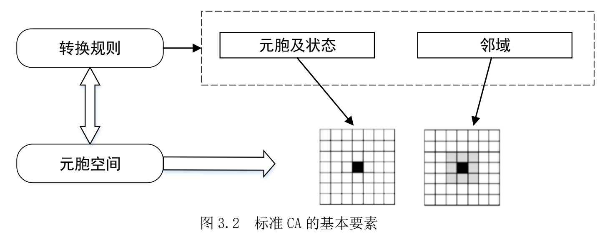

+++
date = '2025-07-25T14:46:08+08:00'
draft = false
title = '约束逻辑回归-元胞自动机'
authors = ["RONGHUA LI"]
tags = ["CA"]
categories = ["科研"]
externalLink = ""
series = ["城市扩张模拟"]

+++

# 元胞自动机（CA）

## 元胞自动机的基本概念

元胞自动机（Cellular Automata，CA）是一种在时空和状态上都离散，空间相互作用和时间因果关系皆基于微观的网格动力学模型[63]。

> [63] 黎夏, 叶嘉安. 约束性单元自动演化 CA 模型及可持续城市发展形态的模拟[J]. 地理学报, 1999, (4):3-12.

元胞自动机**“自下而上”**的研究思路、强大的时空运算的能力及其动态演变的特征为地理学家研究复杂的地理现象提供了新的视角。

谢一春将元胞自动机过程归纳为**结构和运算**两个部分[64]。

> [64] Michael Batty, Yichun Xie. Possible urban automata[J]. Environment and Planning B. 1997, 24: 175-192.

标准的 CA 模型包括：元胞、状态、邻域以及转换规则如（图 3.2）。

### 元胞

**元胞**是元胞自动机最基本的构成单元，通常是规则的**格网单元**，一般按照三角形、 正方形或者六边形网格排列，其中，比较常见的是正方形元胞，分布在离散的欧几里德空间的网格上。

元胞自动机模型中所有元胞无论在时间还是空间上状态都是**离散**的，并且在特定的时刻，每个元胞只可能是**有限状态的一种**。

### 邻域

与元胞相邻的空间，是指以元胞为中心，按一定的规则或形状划分的该元胞的空间集合，是元胞自动机模型中 转换规则基于的要素空间。

### 转换规则

转换规则为当前时刻元胞及其邻域确立一定的规则来确定下 一时刻该元胞的状态，它是 **CA 模型的核心部分**，具有元胞位置无关性。

CA 模型并不是由严格定义的函数或动力方程确定，它构成的方式复杂，转换规则变种很多。

转换规则定义了每个元胞从 t 时刻到 t+1 时刻 的状态转变。

在地理元胞自动机中，获取转换规则的主要方法有：**多准则判断、Logistic 回归、SLEUTH、主成分分析、神经网络和遗传算法等。**

## 城市CA模拟模型

元胞自动机模拟复杂系统从局部到整体时空演化过程的能力同样适用于在模拟和分析具有时间、空间特征的地理复杂系统，因此 CA 模型在城市模拟领域也有较为广泛的应用。

城市 CA 是通过模型与 GIS 耦合实现的。CA 具备强大的演算能力，同时空间数据结构是规则离散的，易与栅格结构的数据相结合，而遥感和 GIS 等平台能够处理海量的时空动态信息和空间数据，与 CA 模型相耦合可以提高对城市的模拟能力，有助于对城市空间扩展动力机制的推演。

城市 CA 模型的本质是通过局域的城市用地动态过程来模拟出全域的城市发展动态变化。

### 元胞的设定

在大多数城市 CA 模型的研究中，**元胞被设定为城市用地、非城市用地或者其它土地利用类型等离散状态**。

### 领域的设定

标准的 CA 主要考虑**邻域**的作用，对标准 CA 的限制条件适当放宽可以更好地模拟出真实城市的发展，如**引入距离变量因子、推演不同城市用地的需求总量**，**增加全局或局域的约束条件以及随机变量**的引入也会影响模拟过程，使城市演变更加真实。

# 逻辑回归（Logistic Regression）分析

[逻辑回归（Logistic Regression） | 菜鸟教程](https://www.runoob.com/ml/ml-logistic-regression.html)

逻辑回归（Logistic Regression）是一种广泛应用于分类问题的统计学习方法，尽管名字中带有"回归"，但它实际上是一种用于二分类或多分类问题的算法。

逻辑回归通过使用逻辑函数（也称为 Sigmoid 函数）将线性回归的输出映射到 0 和 1 之间，从而预测某个事件发生的概率。图 3.3 为 Logistic 回归函数图像。

## 模型公式

定义 m 个自变量𝑋 , 𝑋 ，…, 𝑋 所对应的 Logistic 回归模型为：
$$
\text{logit}(P) = \ln\left( \frac{P}{1 - P} \right) = \beta_0 + \beta_1 X_1 + \beta_2 X_2 + \cdots + \beta_m X_m
$$
其中logit(P)是转化发生概率 P 的自然对数。𝛽 为常数项，𝛽 （i=1,2，… ，𝑚）为各个变量的回归系数。

## 模型输出与类别概率的关系

通过将回归方程的输出设为 logit(P)，从数学上**强制**预测结果必须是一个合法的概率（在 0 和 1 之间）。

如果直接建一个线性回归模型来拟合概率 P，那模型输出的值可以是：

- 小于 0，比如 -0.3 ❌
- 大于 1，比如 1.4 ❌

这些都不是合法的概率值。

逻辑回归模型不直接拟合 P，而是拟合它的**对数几率 logit(P)**。然后通过反函数（sigmoid函数）把它变回概率：

$$
P = \frac{1}{1 + e^{-z}}, \quad \text{其中 } z = \beta_0 + \beta_1 X_1 + \beta_2 X_2 + \cdots + \beta_m X_m
$$
无论 $z$  是多大还是多小，**$P$** **永远在 (0, 1)** 区间内。

> 通过把回归方程的因变量设为 logit(P)，不是直接预测概率，而是预测它的对数几率。然后用 sigmoid 函数将结果「压缩」回 (0, 1)，这就**自动防止了预测值超过 1 或小于 0** 的问题。

# 约束逻辑回归-CA模型的城市化概率

城市三维空间的模拟一般将建筑平面的扩展和建筑高度的增长分开考虑，本文基于**约束 Logistic 回归**的 CA 模型来判断城市**平面**的扩展的适宜性。

在本文中 CA 元胞被设定为**居住用地和商业与公共服务用地、 工业用地、绿地、水体和空地**。

## 逻辑回归-CA模型的城市化概率

城市化是非城市用地向城市用地转化的过程，如果给一个元胞赋二进制状态集合 {0(非城市用地)，1(城市用地)}，如果该元胞状态在下一时刻间是否从 0 变化到 1，就表示该元胞所代表的地块已经城市化。

假设一个城市区位的发展概率是一系列独立变量所构成的函数，因变量是二项分类常量，即土地利用类型分为非城市用地与城市用地。通过二分 Logistic 回归分析，令因变量 Y 服从二项分布, 其二项分布的取值为 0 或 1，Y=1 的概率为 P。

城市化的 CA 层概率为：
$$
p_{i,j}^t(S_{i,j} = \text{urban}) = \frac{\exp(Z_{i,j})}{1 + \exp(Z_{i,j})} = \frac{1}{1 + \exp(-Z_{i,j})}
$$
式中, 𝑆  是单元(i,j)的状态，只有 0(非城市化)和 1(城市化)两种状态；$𝑍_{𝑖,j}$  即通过 Logistic 回归得到的logit(P)值。

## 约束逻辑回归CA模型的城市化概率

在城市用地扩展的过程中，受自然条件或出于生态环境保护的考虑，**并不是所有的土地类型都能转化为城市用地**，应在模型中设置约束层加以修正。因此，经过约束层修正后 t 时刻元胞(i,j) 城市化的最终发展概率为：
$$
p_{i,j}^t(S_{i,j} = \text{urban}) = \frac{1}{1 + \exp(-Z_{i,j})} \times \text{con}(S_{i,j}^t) \times \Omega_{i,j}^t \times \gamma
$$
式中, con()为约束条件，其值∈[0,1]；Ω 为邻域作用部分，表示 t 时刻元胞(i, j)的 3×3 窗口内的开发率；γ为随机变量，其值大于 1。

## 约束逻辑回归-CA模型的组成

### 土地适宜因子

约束 Logistic-CA 模型中，逻辑回归公式（1）中 𝑋  是土地适宜性的影响因子，P 是适宜开发的全局概率。

本文选取**主要河流距离、海岸线影响距离、主要道路影响距离、市中心经济辐射影响距离**作为土地适宜因子。

全局概率 P 由选取的土地适宜因子和两期土地利用变化数据进行抽样估算，在模型迭代中固定不变。

### 邻域作用

根据 Tobler 第一定律，距离越近的地理实体空间相关性越强。通常情况下城市用地适宜性的空间分布也遵循这种规律，这也是城市用地的规模效应和集聚效应。

若某一地块周围的大部分用地都被开发，而且自身适宜开发，则该地块演化为城市用地的可能性很大。同时，土地利用变化的趋势是趋于紧凑的，也是兼顾了城市用地的形态特征，避免空间布局分散破碎。

邻域作用部分通过 3×3 的窗口计算城市用地在空间上的互相影响：
$$
\Omega_{i,j}^t =  \frac{\text{con}(S_{i,j}= \text{urban})}{3+3-1})
$$
其中，Ω 是邻域函数，$\text{con}(S_{i,j}= \text{urban})$ 为$S_{i,j}$ 城市用地的条件函数。

### 约束条件

城市用地的转化，除了受地理特征变量影响之外，另外还要受到自然条件的影响如地表坡度和土壤性质等。

本文在约束模型中考虑了地表坡度限制因素。若元胞位置的坡度大于 25%，则认为它不能转化为城市元胞，记表达式如下：
$$
p_{\text{constraint}} =
\begin{cases}
1, & \text{slope} \leq 25\% \\
0, & \text{slope} > 25\%
\end{cases}
$$

### 随机因素

真实城市空间的扩展会受到各种不确定因素的影响和干预。为了反映出城市发展所 存在的随机性，需要向模型中加入随机因素的作用。该项可表达为：
$$
\gamma = 1 + (-\text{lgr})^{\alpha}
$$
式中 r 为（0,1）内的随机数，α为扰动强度，取值范围为 1-10 之间的整数。

# 参考文献

[1]甘喜庆.基于约束logistic-CA模型的城市扩张空间形态研究[D].中南大学,2008.

[2]刘兴权,吴涛,甘喜庆.基于可控邻域作用CA的城市扩张研究[J].国土资源遥感,2011,(02):110-114.

[3]陈晨.基于CA/MAS的城市三维空间扩展及动态模拟研究[D].辽宁师范大学,2018.
